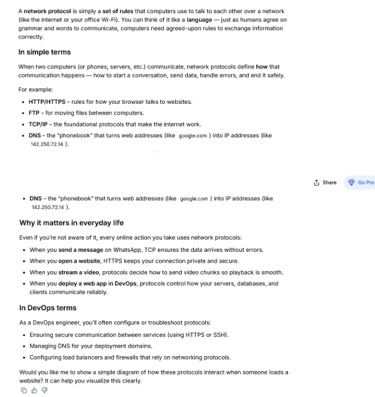
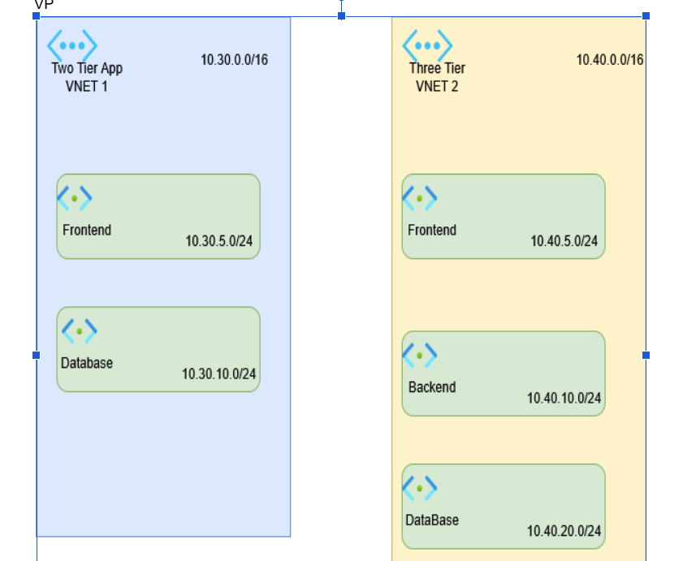
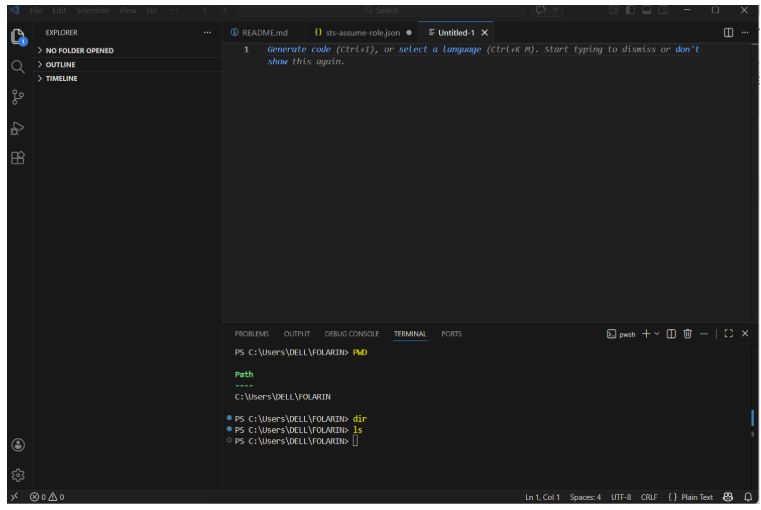

# Week 00 - Internet and Networking

Part of the DevOps Micro Internship (DMI) Cohort 3 with Agentic AI

---

# 🧑‍💻 Task 1: Using ChatGPT as Your Learning Assistant

## Scenario

You're new to DevOps and will frequently encounter technical questions. ChatGPT can be your learning companion.

## Your Task

Write a clear ChatGPT prompt to help you understand:

> "What is a protocol in networking? Explain with a simple real-life example."

Take a screenshot of your interaction showing:

* Your detailed prompt (with clear expectations)
* ChatGPT's simplified response with an example

## Screenshot

Save your screenshot in the `screenshots` folder and update the file name below.




Replace `task-1-chatgpt.png` with your actual screenshot file name.

---

## What I Learned (2–3 lines)

I learnt how network protocol works 

---

# 🌐 Task 2: Internet and Networking

## Scenario

Your friend is launching an online bookstore named **EpicReads**.

He asked you to explain how users globally can access his website hosted in Finland.

## Your Task

Write a short explanation (**100–150 words**) that includes:

* Packet Switching
* IP Address
* TCP/IP
* HTTP/HTTPS

💡 **Tip:** You may use ChatGPT (as demonstrated in Task 1) to refine your explanation.

## Answer

Packet Switching: When a user visits EpicReads, their data doesn’t travel as one big message. Instead, it’s broken into small “packets” that move across various routes on the internet. This method, called packet switching, ensures reliable, fast delivery even if some routes are busy or temporarily down.
IP Address: The EpicReads website has a unique IP address — like its digital street address — assigned to its server in Finland. When users around the world type the bookstore’s domain name, their devices use this IP to locate and connect to the correct server.
TCP/IP: The Transmission Control Protocol/Internet Protocol manages how data packets travel between users’ computers and the EpicReads server. It ensures packets arrive complete, in the right order, and without errors — making the site load smoothly.
HTTP/HTTPS: Finally, users access EpicReads through HTTP or HTTPS, the web protocols that deliver web pages. HTTPS adds encryption, protecting customer data like login details or payment information while they browse and buy books.


---

# 🏗️ Task 3: Application Architecture & Stack

## Scenario

EpicReads bookstore has two application versions:

### Two-Tier Application

* Frontend
* Database

### Three-Tier Application

* Frontend
* Backend
* Database

## Your Task

* Draw simple diagrams (hand-drawn or tool-based such as draw.io)
* Label each layer clearly
* List at least two common technologies or tools used for each layer
* Submit a screenshot or photo clearly showing your own drawing

## Diagram Screenshot / Photo

Save your diagram image in the `screenshots` folder and update the file name below.




Replace `task-3-diagram.png` with your actual diagram file name.

---

## Technologies Used

### Frontend

* Vitual Network
* Subnet

### Backend

* Cida Block
* Vitual Network

### Database

* Vitual Network
* Security Network

---

# 🌍 Task 4: Domain Name & DNS (Basic Concepts)

## Scenario

Your friend's bookstore **EpicReads** is currently accessible through:

```text
52.172.142.222:3000
```

He purchased the domain:

```text
epicreads.com
```

## Your Task

In **50–100 words**, explain in your own words:

1. What is DNS (Domain Name System)?
2. Which DNS record type should be used to connect the domain to the given IP, and why?

## Answer

DNS ( Domain Name System): This is a unique identifier name that someone chooses for a brand. It is easily remembered when linked to the host IP to access the internet. 

A record (Address record). Maps the domain name already purchased  directly to the host IP 52.172.142.222:3000., allowing users to access EpicReads by typing epicreads.com instead of the numeric IP.


---

# 💻 Task 5: Visual Studio Code Setup (Hands-on)

## Your Task

Install Visual Studio Code (if not already installed).

Take a screenshot of your VS Code environment showing:

* Terminal open inside VS Code
* Running a basic command:

### Windows

```powershell
dir
```

### Linux / macOS

```bash
pwd
ls
```

* Your selected VS Code theme clearly visible

⚠️ **Important:** The screenshot must show your username or another identifiable detail to confirm it is your environment.

## Screenshot

Save your screenshot in the `screenshots` folder and update the file name below.




Replace `task-5-vscode.png` with your actual screenshot file name.

---

# 🔗 Task 6: Publish Your Assignment as a LinkedIn Post

## Objective

Publishing on LinkedIn helps you:

* Build your professional online presence
* Reinforce your learning
* Document your DevOps journey publicly

## Your Task

Summarize your answers from Tasks 1–5 into a LinkedIn post.

Clearly structure your post into the following sections:

* ChatGPT
* Internet & Networking
* App Architecture
* DNS
* VS Code Setup

Add the following credit note at the end of your post:

> **P.S. This post is a part of DevOps Micro Internship with Agentic AI Cohort-3 by Pravin Mishra. You can start your DevOps journey by joining this Discord community: https://discord.pravinmishra.com/**

---

## LinkedIn Post URL

Paste your LinkedIn post URL here:

https://www.linkedin.com/posts/wale-folarin-956b6022a_chatgpt-a-network-protocol-is-a-set-of-rules-activity-7441789056885084161-Hkgz?utm_source=share&utm_medium=member_desktop&rcm=ACoAADl6z1IBZjWVdPX--51VXY7TxU7dXOVzE3c

---

## LinkedIn Post Backup Copy

Paste the full text of your LinkedIn post here:

ChatGPT
A network protocol is a set of rules that lets computers communicate over networks, much like a shared language. It defines how data is sent, received, and managed between devices.

Examples include HTTP/HTTPS for web access, FTP for file transfers, TCP/IP for internet communication, and DNS for translating domain names into IP addresses.

In daily life, these protocols enable secure browsing, error-free messaging, smooth streaming, and reliable app performance.
For DevOps, they’re crucial for configuring secure communication, managing DNS, and maintaining network reliability across systems.

Internet & Networking
When users visit EpicReads, their data is split into small packets through packet switching for fast, reliable transfer.
The website’s IP address acts like a digital address, guiding browsers to the right server in Finland.
TCP/IP ensures these packets reach correctly and in order, keeping communication smooth.
Finally, HTTP/HTTPS delivers the website securely, with HTTPS encrypting customer information during browsing and purchases.

Application Architecture
VNET 1 – Two-Tier App (10.30.0.0/16): Contains a Frontend subnet (10.30.5.0/24) and a Database subnet (10.30.10.0/24).
VNET 2 – Three-Tier App (10.40.0.0/16): Includes Frontend (10.40.5.0/24), Backend (10.40.10.0/24), and Database (10.40.20.0/24) subnets.


DNS (Domain Name System)
DNS translates a brand’s easy-to-remember domain name into its server’s IP address.
An A record connects epicreads.com to 52.172.142.222:3000, letting users access the site without using the numeric IP.

VS Code Setup
In Visual Studio Code, you can open a terminal to run basic system commands.
Use pwd on Linux/Mac or dir on Windows to see your current directory.
Use ls on Linux/Mac to list the files within that directory. 

This post is part of the FREE DevOps Micro Internship Cohort run by Pravin Mishra You can start your DevOps journey for free from his YouTube Playlist.

---

# Reflection – Week 0

### What did you find easy?

Understanding VS Code

---

### What was difficult?

Understanding DNS

---

### What will you improve next week?

I will improve how I ask chatgpt for task

---

## 📌 About DMI & CloudAdvisory

DevOps Micro Internship (DMI) is a project-based DevOps program run by Pravin Mishra (The CloudAdvisory) focused on real-world execution, systems thinking, and career readiness.

It helps learners build strong DevOps foundations with hands-on experience.


## 📌 Resources

- 🌐 **DMI Official Website:** https://pravinmishra.com/dmi  
- 🎓 **DevOps for Beginners (Udemy):** https://www.udemy.com/course/devops-for-beginners-docker-k8s-cloud-cicd-4-projects/  
- 🎓 **Ultimate Agentic AI DevOps with Clude Code** https://www.udemy.com/course/ultimate-agentic-ai-devops-with-claude-code/?referralCode=448389767BC96284087B
- 🎓 **DevOps with Claude Code: Terraform, EKS, ArgoCD & Helm** https://www.udemy.com/course/devops-with-claude-code-terraform-eks-argocd-helm/?referralCode=1C5B734505D65A010FA3
- ▶️ **YouTube Playlist (DMI Cohort 3):** https://www.youtube.com/playlist?list=PLFeSNDtI4Cho  
- 🔗 **Pravin Mishra (LinkedIn):** https://www.linkedin.com/in/pravin-mishra-aws-trainer/  
- 🏢 **CloudAdvisory (LinkedIn):** https://www.linkedin.com/company/thecloudadvisory/

---

*This submission is part of DevOps Micro Internship (DMI) Cohort 3 — Agentic AI Track*