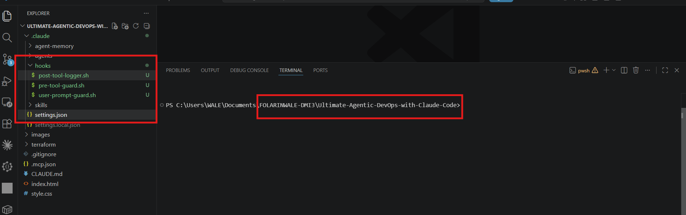
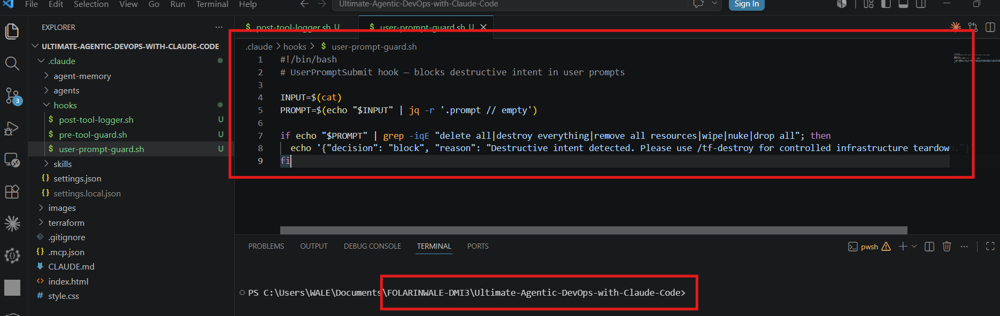
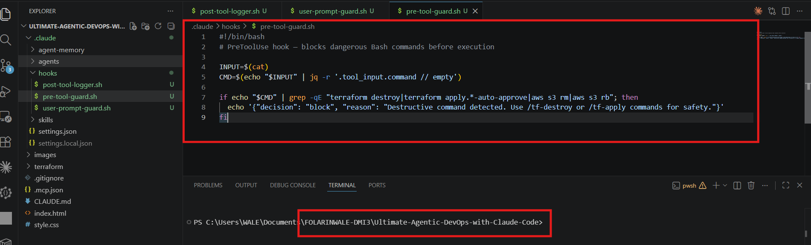
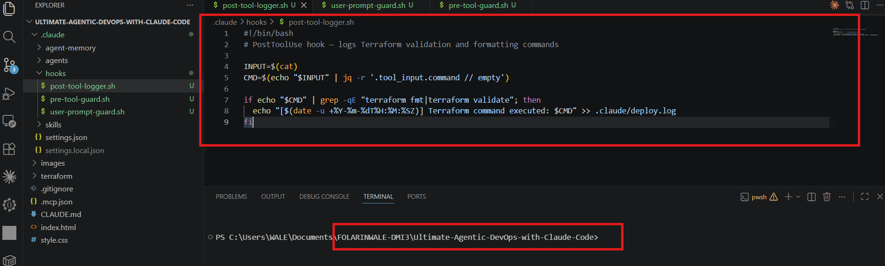
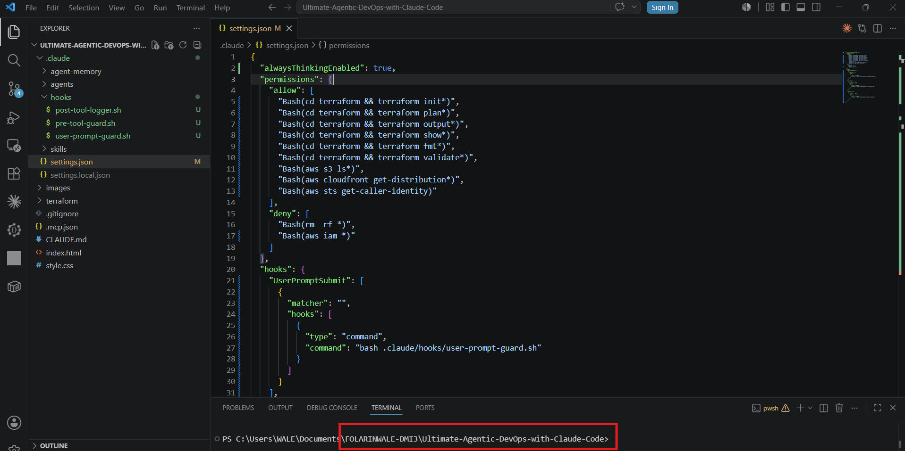
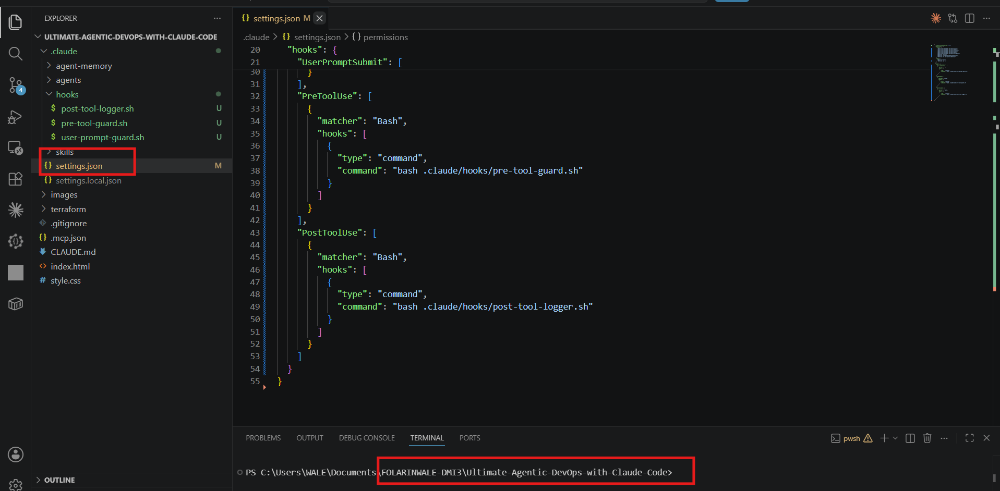

# Assignment 6 — Safety Rails for Your AI Agent

Part of the DevOps Micro Internship (DMI) Cohort 3 with Agentic AI

---

## Purpose

In this assignment, you will configure safety and control mechanisms for Claude Code using permissions and hooks. You will define team-level command restrictions and implement prompt-level and tool-level hooks to prevent destructive actions before they execute.

---

# Task 1 — Create Claude Code Configuration Structure

## Goal

Create the `.claude` directory structure required for team-level Claude Code configuration.

### Evidence

#### Screenshot 1 — `.claude` folder structure visible in VS Code Explorer

---

# Task 2 — Create the UserPromptSubmit Hook Script

## Goal

Create a hook that checks user prompts before Claude processes them and blocks requests containing destructive intent.

### Evidence

#### Screenshot 2 — `user-prompt-guard.sh` open in VS Code showing the hook script

---

# Task 3 — Create the PreToolUse Hook Script

## Goal

Create a hook that runs before Claude executes Bash commands and blocks dangerous infrastructure commands.

### Evidence

#### Screenshot 3 — `pre-tool-guard.sh` open in VS Code showing the hook script

---

# Task 4 — Create the PostToolUse Hook Script

## Goal

Create a hook that runs after Claude executes a Bash command and logs selected Terraform commands.

### Evidence

#### Screenshot 4 — `post-tool-logger.sh` open in VS Code showing the hook script

---

# Task 5 — Configure settings.json to Connect Hook Scripts

## Goal

Configure Claude Code permissions and connect the hook scripts created in the previous tasks.

### Evidence

#### Screenshot 5 — `settings.json` open in VS Code showing permissions and hooks configuration

---

# Submission Instructions

- Ensure `.claude/settings.json` is committed to your GitHub repository
- Run both hook tests successfully and capture required screenshots
- Push final changes to your forked repository

---

## GitHub Repository URL

Paste your forked repository URL here:

`__________________________`

---

# Completion Checklist

- [ ] `.claude` folder structure created correctly
- [ ] `user-prompt-guard.sh` created with UserPromptSubmit hook logic
- [ ] `pre-tool-guard.sh` created with PreToolUse hook logic
- [ ] `post-tool-logger.sh` created with PostToolUse logging logic
- [ ] `settings.json` created with allow and deny permissions
- [ ] `settings.json` configured to connect all three hooks:
  - [ ] UserPromptSubmit
  - [ ] PreToolUse
  - [ ] PostToolUse
- [ ] Destructive prompt test shows UserPromptSubmit blocked the request
- [ ] Terraform destroy command test shows PreToolUse intercepted the command
- [ ] Terraform validate test shows PostToolUse created the log entry
- [ ] All required screenshots are captured

---

## 📌 About DMI & CloudAdvisory

DevOps Micro Internship (DMI) is a project-based DevOps program run by Pravin Mishra (The CloudAdvisory) focused on real-world execution, systems thinking, and career readiness.

It helps learners build strong DevOps foundations with hands-on experience.

---

## 📌 Resources

- 🌐 DMI Official Website: https://pravinmishra.com/dmi  
- 🎓 DevOps for Beginners (Udemy): https://www.udemy.com/course/devops-for-beginners-docker-k8s-cloud-cicd-4-projects/  
- 🎓 Agentic AI DevOps with Claude Code: https://www.udemy.com/course/ultimate-agentic-ai-devops-with-claude-code/  
- 🎓 DevOps with Claude Code: Terraform, EKS, ArgoCD & Helm: https://www.udemy.com/course/devops-with-claude-code-terraform-eks-argocd-helm/  
- ▶️ YouTube Playlist: https://www.youtube.com/playlist?list=PLFeSNDtI4Cho  
- 🔗 Pravin Mishra (LinkedIn): https://www.linkedin.com/in/pravin-mishra-aws-trainer/  
- 🏢 CloudAdvisory (LinkedIn): https://www.linkedin.com/company/thecloudadvisory/

---

*This submission is part of DevOps Micro Internship (DMI) Cohort 3 — Agentic AI Track.*