# Assignment 5 — Bash Script Automation Drill (OPS Checklist)

Part of the DevOps Micro Internship (DMI) Cohort 3 with Agentic AI

---

## Purpose

In this assignment, you will practice Bash scripting by building a series of small automation scripts covering environment setup, variables, arrays, loops, file conditionals, if-else logic, and functions. These scripts form the foundation of real-world Linux automation used in DevOps, cloud, and production support environments.

---

# Task 1 — Bash Environment & Workspace Setup

## Goal

Verify that Bash is available on your system and create a clean workspace for this assignment.

### Evidence

#### Screenshot 1 — Output of `echo $SHELL` and `bash --version`

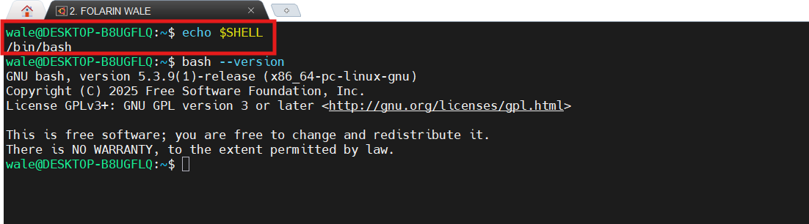

---

#### Screenshot 2 — Output of `pwd` and `ls -lah` showing the scripts directory

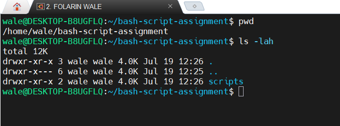

---

### Notes

Answer the following in your own words:

**1. What is Bash?**

Bash (Bourne Again Shell) is a command-line shell and scripting language used to interact with Linux and Unix operating systems.

---

**2. What is the difference between shell and Bash?**

A shell is any command-line interface that allows users to interact with an operating system.
Bash is a specific type of shell that is widely used on Linux and includes scripting and automation features.

---

**3. Why is it important to confirm the Bash version before writing scripts?**

To be sure bash is installed 

---

# Task 2 — Your First Bash Script

## Goal

Create your first Bash script, make it executable, and run it from the terminal.

### Evidence

#### Screenshot 1 — Content of `first-script.sh`

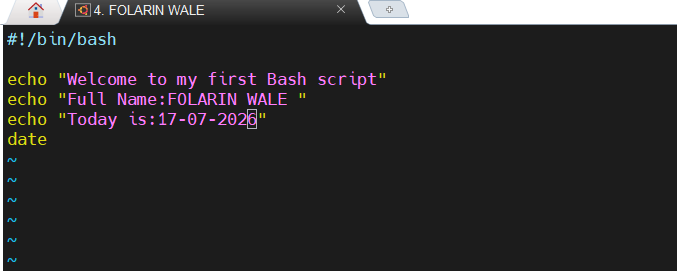

---

#### Screenshot 2 — Output of `./first-script.sh`

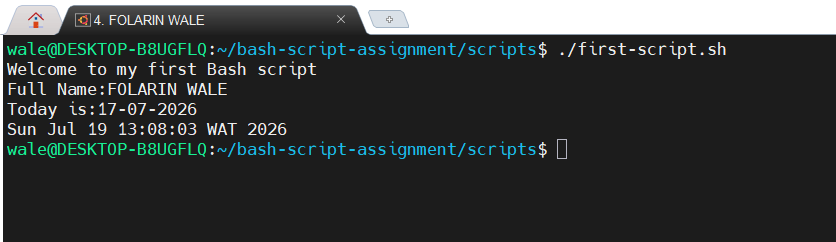

---

#### Screenshot 3 — Output of `ls -l first-script.sh` showing executable permission

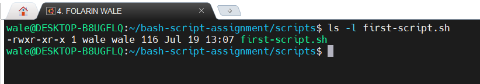

---

### Notes

Answer the following in your own words:

**1. What is the purpose of `#!/bin/bash`?**

It tells the operating system to use the Bash shell to execute the script.
This ensures the script runs with the correct interpreter.

---

**2. Why do we use `chmod +x` before running a script?**

gives the script execute permission.

---

**3. What is the difference between running a script using `./script.sh` and `bash script.sh`?**

./script.sh runs the script as an executable and requires execute permission (chmod +x).
bash script.sh runs the script using the Bash interpreter directly, so execute permission is not required.

---

# Task 3 — Variables: User Information Script

## Goal

Use variables to store and display user-related information.

### Evidence

#### Screenshot 1 — Content of `user-info.sh`

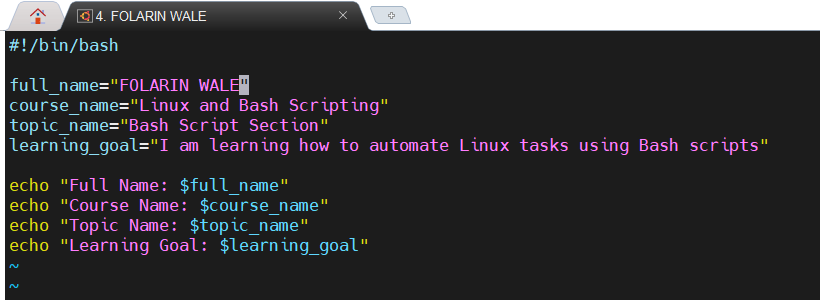

---

#### Screenshot 2 — Output of `./user-info.sh`

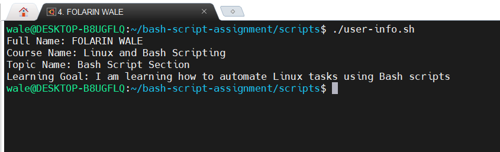

---

### Notes

Answer the following in your own words:

**1. What is a variable in Bash?**

It allows you to store and reuse values throughout a Bash script.

---

**2. Why should we avoid spaces around the `=` sign when creating variables?**

Adding spaces causes Bash to treat the assignment as a command and results in an error.

---

**3. How do you access the value stored inside a Bash variable?**

Use the $ symbol before the variable name.

---

# Task 4 — Arrays & Loops: Tools Checklist Script

## Goal

Use arrays and loops to print a checklist of tools used in Bash scripting.

### Evidence

#### Screenshot 1 — Content of `tools-checklist.sh`

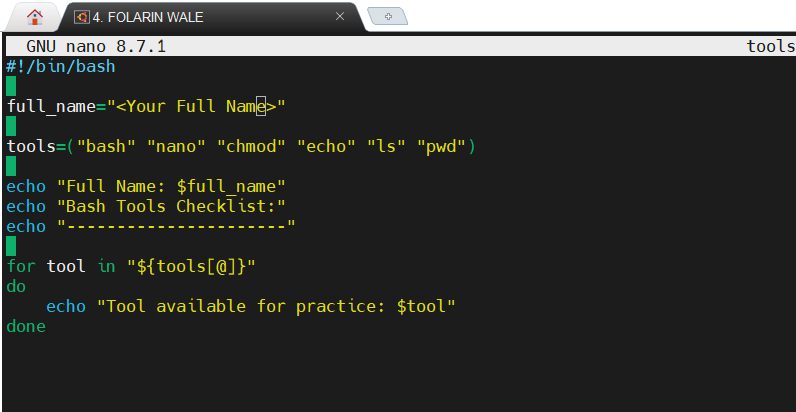

---

#### Screenshot 2 — Output of `./tools-checklist.sh`

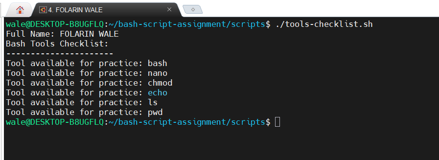

---

### Notes

Answer the following in your own words:

**1. What is an array in Bash?**

An array is a variable that can store multiple values under a single name.
Each value is accessed using its index.

---

**2. Why are arrays useful in scripts?**

Arrays make it easy to store and process multiple related values.
They help reduce repetitive code and simplify loops.

---

**3. What does `"${tools[@]}"` mean?**

Represents all the elements in the tools array.
It is commonly used to loop through or display every value in the array.

---

**4. What is the purpose of the `for` loop in this script?**

The for loop repeats a block of code for each item in the array.
It allows the script to process every element automatically without writing the same code multiple times.

---

# Task 5 — Loops: Number Counter Script

## Goal

Use loops to repeat a task multiple times.

### Evidence

#### Screenshot 1 — Content of `counter.sh`

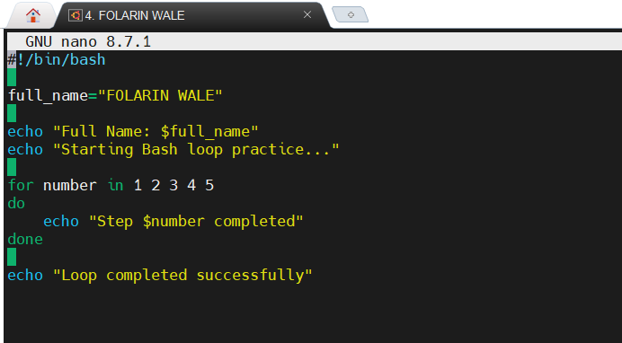

---

#### Screenshot 2 — Output of `./counter.sh`

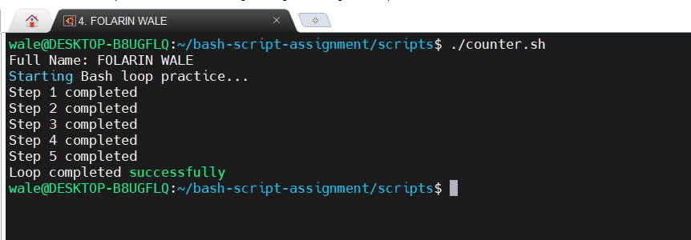

---

### Notes

Answer the following in your own words:

**1. What is a loop?**

A loop is a programming structure that repeats a block of code multiple times.
It continues until a specified condition is met or all items have been processed.

---

**2. Why do we use loops in Bash scripting?**

Loops automate repetitive tasks and reduce the amount of code you need to write.
They make scripts more efficient and easier to maintain.

---

**3. How many times did the loop run in your script?**

The loop ran 5 times

---

**4. What would you change if you wanted the loop to run 10 times?**

Change the loop condition or range to 10.

---

# Task 6 — Files & Conditionals: File Validation Script

## Goal

Use file checks and conditionals to verify whether files and directories exist.

### Evidence

#### Screenshot 1 — Output of `ls -lah ../test-folder`

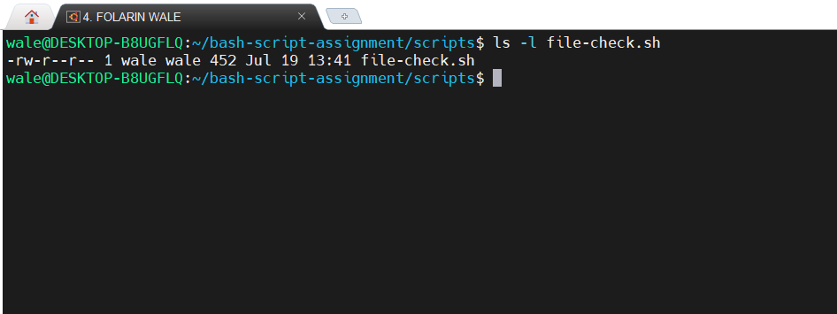

---

#### Screenshot 2 — Content of `file-check.sh`

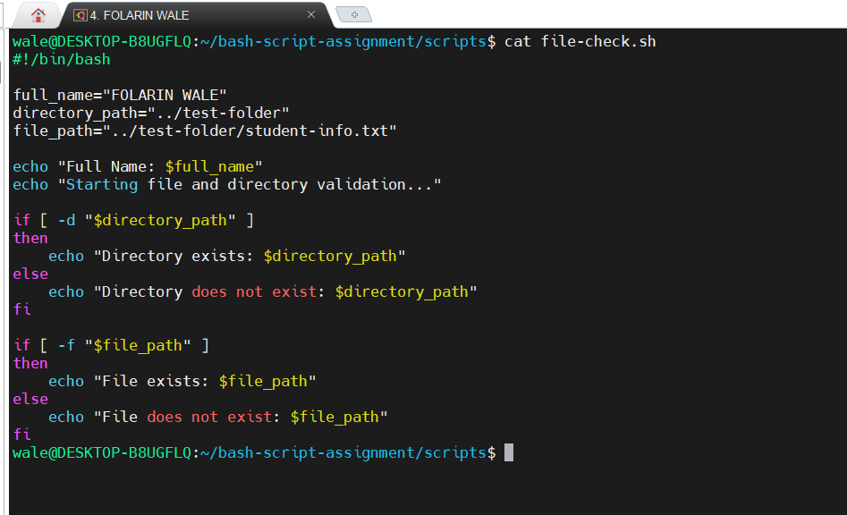

---

#### Screenshot 3 — Output of `./file-check.sh`

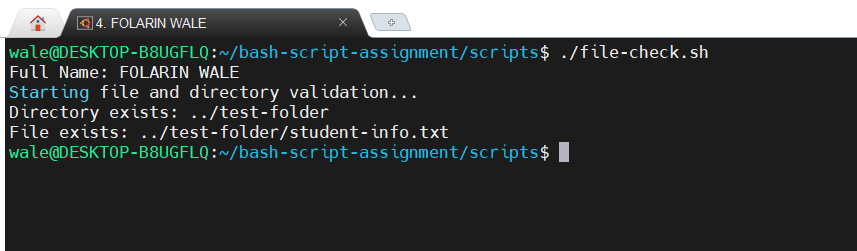

---

### Notes

Answer the following in your own words:

**1. What does `-d` check in Bash?**

-d checks whether a specified path is a directory.
It returns true if the directory exists.

---

**2. What does `-f` check in Bash?**

-f checks whether a specified path is a regular file.
It returns true if the file exists.

---

**3. Why should file and directory paths be stored in variables?**

Storing paths in variables makes scripts easier to read, update, and reuse.
It also avoids repeating the same path multiple times.

---

**4. What happens if the file does not exist?**

The -f test returns false, echo- file does not exit

---

# Task 7 — Conditionals: Pass or Retry Script

## Goal

Use if-else conditionals to make decisions based on a variable value.

### Evidence

#### Screenshot 1 — Content of `score-check.sh` with `score=85`

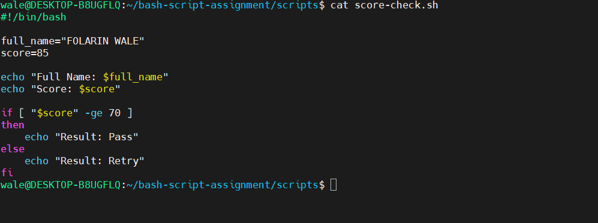

---

#### Screenshot 2 — Output showing `Result: Pass`

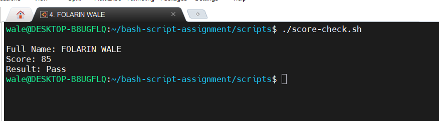

---

#### Screenshot 3 — Content of `score-check.sh` with `score=55`

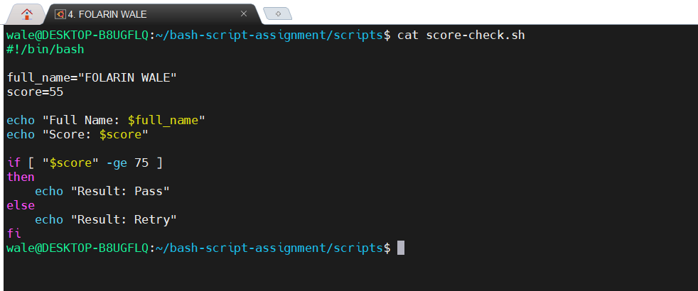

---

#### Screenshot 4 — Output showing `Result: Retry`

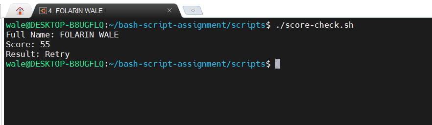

---

### Notes

Answer the following in your own words:

**1. What is the purpose of if-else in Bash?**

The if-else statement is used to make decisions based on a condition.
It executes one block of code if the condition is true and another if it is false.

---

**2. What does `-ge` mean?**

It is used to compare two integer values in Bash.

---

**3. Why should conditions be tested with different values?**

It helps identify and fix errors before using the script in production.

---

**4. How can conditionals help in automation scripts?**

They help automate tasks such as checking files, validating inputs, and handling errors.

---

# Task 8 — Functions: Final Bash Automation Script

## Goal

Create a final Bash script using functions to organize reusable code.

### Evidence

#### Screenshot 1 — Content of `final-automation.sh`

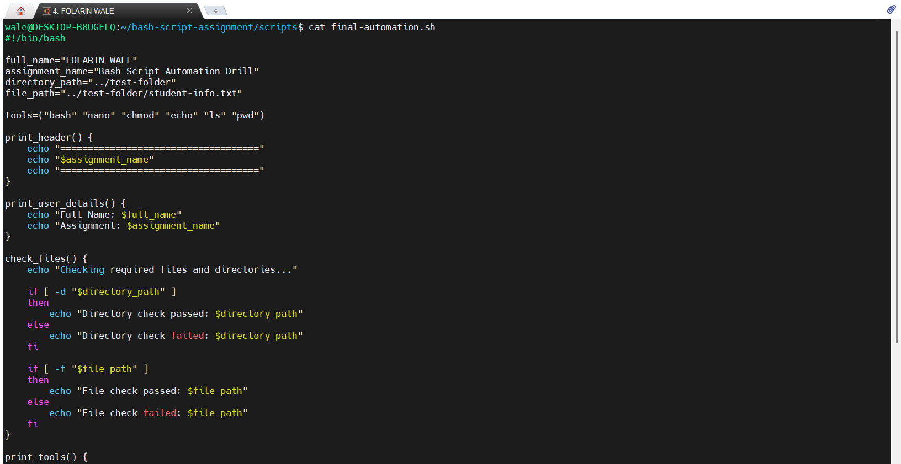

---

#### Screenshot 2 — Output of `./final-automation.sh`

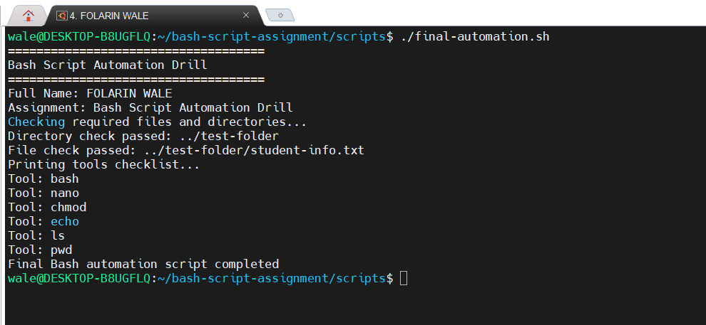

---

#### Screenshot 3 — Output of `ls -lah` showing all created scripts

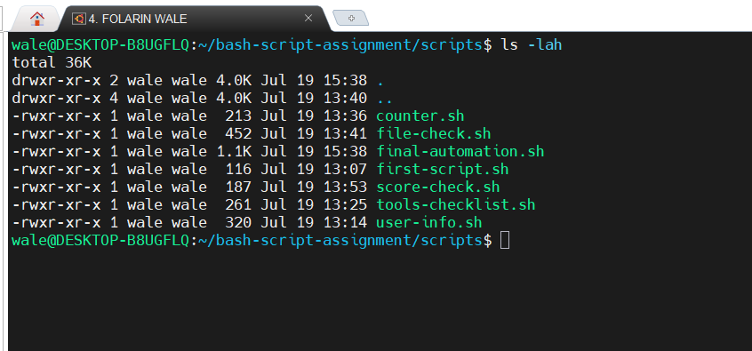

---

### Notes

Answer the following in your own words:

**1. What is a function in Bash?**

It helps organize scripts and avoids repeating the same code.

---

**2. Why are functions useful in scripts?**

They reduce code duplication and simplify troubleshooting.

---

**3. Which functions did you create in this script?**

I created functions to organize and execute specific tasks within the script.

---

**4. How does this final script combine variables, arrays, loops, conditionals, files, and functions?**

The script uses variables to store data, arrays to manage multiple values, loops to repeat tasks, conditionals to make decisions, file checks to verify files and directories, and functions to organize the code into reusable sections. Together, these features make the script more efficient, readable, and easier to maintain.

---

# LinkedIn Post (Required)

## Evidence

#### LinkedIn Post URL

Paste your LinkedIn post URL here:

(https://www.linkedin.com/posts/wale-folarin-956b6022a_devops-linux-bash-ugcPost-7484630349214437376-3aAo/?utm_source=share&utm_medium=member_desktop&rcm=ACoAADl6z1IBZjWVdPX--51VXY7TxU7dXOVzE3c)

---

#### Screenshot — Published LinkedIn post

---

# Submission Instructions

- Add all required screenshots in your submission
- Full name must be visible in required screenshots
- All script files must be created and run successfully
- Required notes must be answered clearly for every task
- Do not expose sensitive information (keys, passwords, credentials)

---

# Completion Checklist

- [ ] Task 1: Environment setup verified, workspace created (Screenshots 1–2, Notes answered)
- [ ] Task 2: First script created, executed, permissions verified (Screenshots 1–3, Notes answered)
- [ ] Task 3: Variables script created and run (Screenshots 1–2, Notes answered)
- [ ] Task 4: Arrays and loops script created and run (Screenshots 1–2, Notes answered)
- [ ] Task 5: Counter loop script created and run (Screenshots 1–2, Notes answered)
- [ ] Task 6: File validation script created and run (Screenshots 1–3, Notes answered)
- [ ] Task 7: Pass/Retry conditional script tested with both values (Screenshots 1–4, Notes answered)
- [ ] Task 8: Final automation script created and run (Screenshots 1–3, Notes answered)
- [ ] All scripts run without errors
- [ ] Full Name visible in all required screenshots
- [ ] LinkedIn post published and URL submitted
- [ ] No sensitive data exposed

---

## 📌 About DMI & CloudAdvisory

DevOps Micro Internship (DMI) is a project-based DevOps program run by Pravin Mishra (The CloudAdvisory) focused on real-world execution, systems thinking, and career readiness.

It helps learners build strong DevOps foundations with hands-on experience.

---

## 📌 Resources

- 🌐 DMI Official Website: https://pravinmishra.com/dmi  
- 🎓 DevOps for Beginners (Udemy): https://www.udemy.com/course/devops-for-beginners-docker-k8s-cloud-cicd-4-projects/  
- 🎓 Agentic AI DevOps with Claude Code: https://www.udemy.com/course/ultimate-agentic-ai-devops-with-claude-code/  
- 🎓 DevOps with Claude Code: Terraform, EKS, ArgoCD & Helm: https://www.udemy.com/course/devops-with-claude-code-terraform-eks-argocd-helm/  
- ▶️ YouTube Playlist: https://www.youtube.com/playlist?list=PLFeSNDtI4Cho  
- 🔗 Pravin Mishra (LinkedIn): https://www.linkedin.com/in/pravin-mishra-aws-trainer/  
- 🏢 CloudAdvisory (LinkedIn): https://www.linkedin.com/company/thecloudadvisory/

---

*This submission is part of DevOps Micro Internship (DMI) Cohort 3 — Agentic AI Track.*