# Assignment 6 — Build an AI-Assisted Linux Health Check (AI-Assisted Linux Incident Triage)

Part of the DevOps Micro Internship (DMI) Cohort 3 with Agentic AI

---

## Purpose

In this assignment, you will build a read-only Bash triage script that checks the health of your Ubuntu server and Nginx application, connect it to Claude Code as a reusable `/linux-triage` skill, simulate a controlled Nginx incident, use the skill to gather and analyze evidence, recover the service manually, and verify recovery. The workflow follows the Agentic Loop: Gather → Analyze → Human Act → Verify.

---

# Task 1 — Confirm the Healthy Baseline and Create the Workspace

## Goal

Confirm that Nginx and the React application are healthy before building the automation.

### Evidence

#### Screenshot 1 — Output of `systemctl is-active nginx`, `ss -ltn | grep ':80'`, and `curl -I http://localhost`

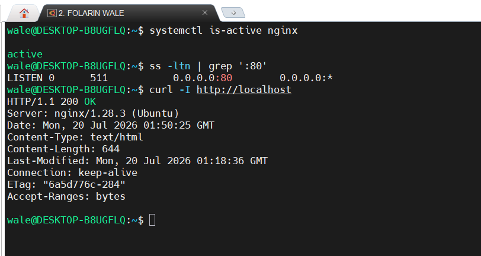

---

#### Screenshot 2 — Output of `pwd` and `find . -maxdepth 4 -type d | sort` showing the workspace folder structure

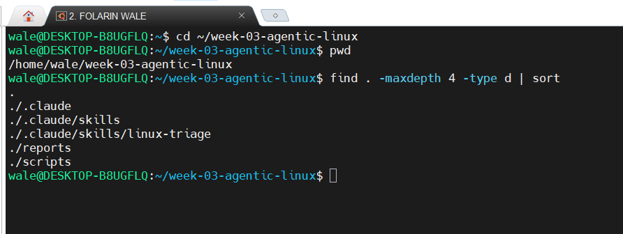

---

### Notes

Answer the following in your own words:

**1. What proves that Nginx is running?**

The command systemctl is-active nginx returns active, confirming that the Nginx service is running.

---

**2. What proves that the server is listening for HTTP traffic?**

The command ss -ltn | grep ':80' shows LISTEN on port 80, proving the server is accepting HTTP connections.

---

**3. Why must you capture a healthy baseline before simulating an incident?**

A healthy baseline provides a known working state, making it easier to identify what changed and verify that the system has recovered after the incident.

---

# Task 2 — Create Project Context and Safety Rules in CLAUDE.md

## Goal

Tell Claude exactly what this project does and what it is not allowed to do.

### Evidence

#### Screenshot 3 — CLAUDE.md open in VS Code showing all four sections (Project Overview, Incident Workflow, Safety Rules, Output Rules)

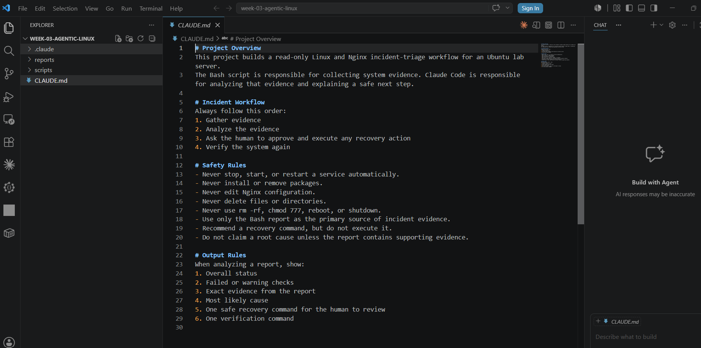

---

### Notes

Answer the following in your own words:

**1. Why should Claude receive project-specific operational rules?**

Project-specific operational rules ensure Claude follows the defined workflow and safety guidelines for the project.

---

**2. Why is the human required to execute the recovery command?**

The human executes the recovery command because the safety rules state Claude should only recommend recovery actions, not perform them.

---

**3. Which rule prevents Claude from making an unsupported diagnosis?**

The rule "Do not claim a root cause unless the report contains supporting evidence." prevents Claude from making an unsupported diagnosis.

---

# Task 3 — Use Agentic AI to Plan Before Writing the Script

## Goal

Use Claude Code to inspect the environment and produce a read-only plan before creating any Bash code.

### Evidence

#### Screenshot 4 — Claude Code showing the five-check plan and read-only inspection results

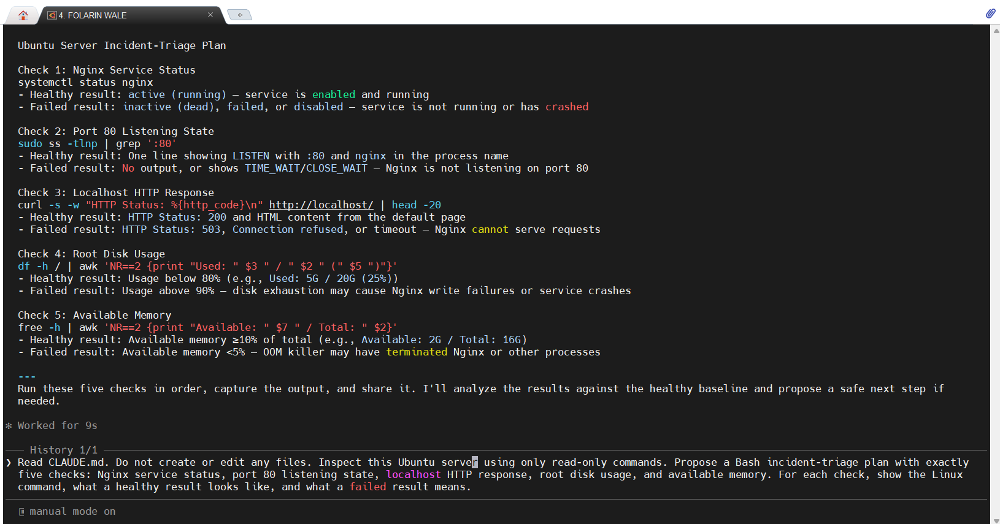

---

### Notes

Answer the following in your own words:

**1. Which part of this task represents the Gather phase?**

The five system checks (Nginx status, port 80, localhost response, disk usage, and available memory) represent the Gather phase because they collect evidence about the server's health.

---

**2. Did Claude follow the instruction not to create files? How did you verify this?**

Yes. Claude only generated a read-only incident-triage plan in the chat and did not create or edit any files, as instructed.

---

**3. Why is planning before coding useful in DevOps automation?**

Planning ensures the correct checks and safe steps are identified before making changes, reducing the risk of errors in production.

---

# Task 4 — Build the Linux Triage Bash Script

## Goal

Create one Bash script that gathers consistent Linux and Nginx health evidence.

### Evidence

#### Screenshot 5 — Top section of `linux-triage.sh` showing variables, thresholds, and the checks array

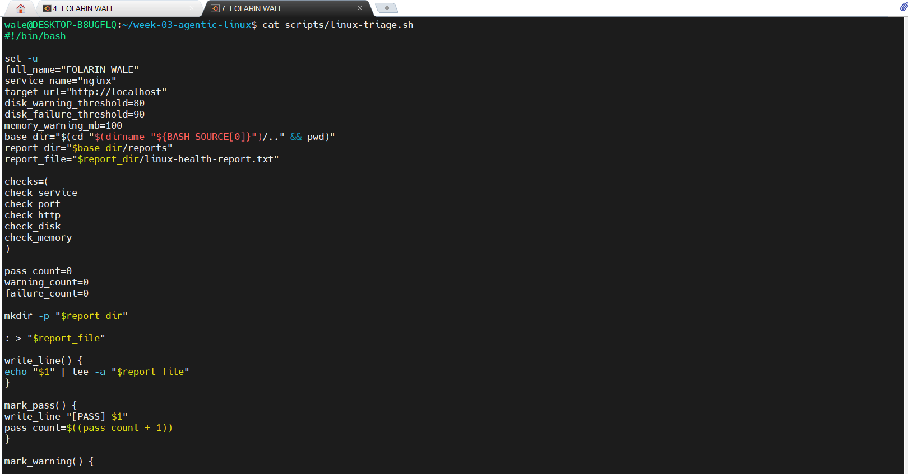

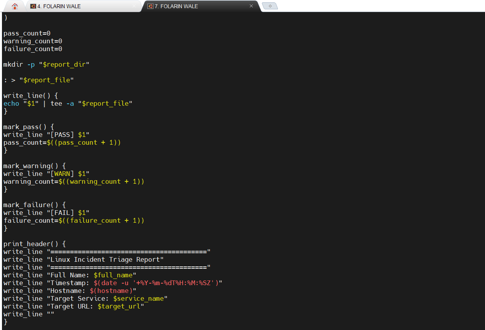

---

#### Screenshot 6 — Middle section showing check functions and conditionals

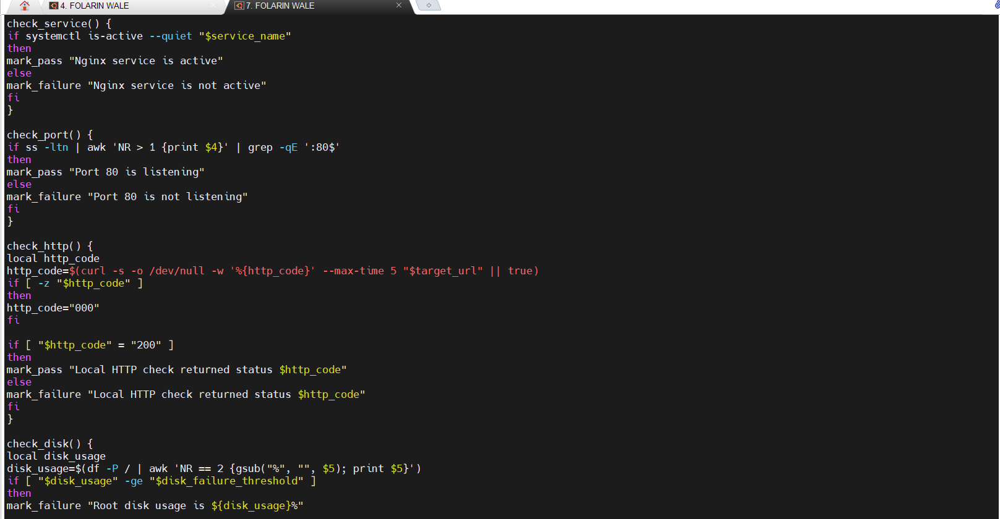

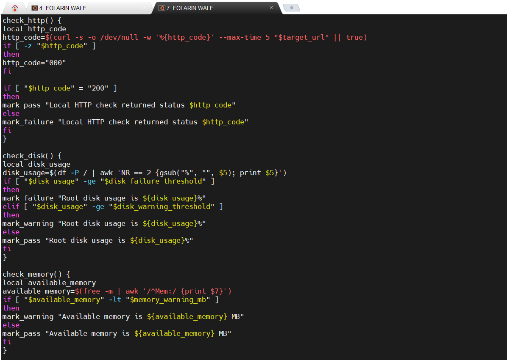

---

#### Screenshot 7 — Bottom section showing the loop, summary function, and exit behavior

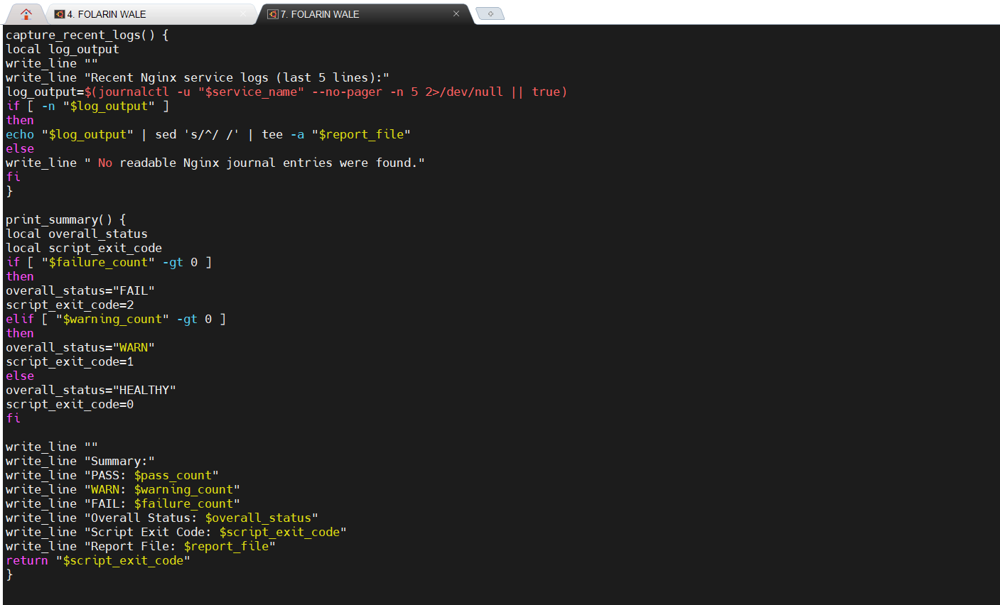

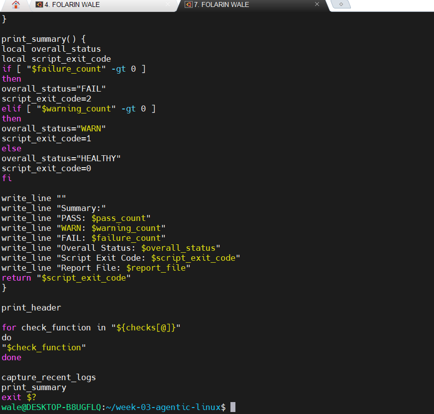

---

#### Screenshot 8 — Output of `bash -n scripts/linux-triage.sh` (no syntax errors) and `ls -l scripts/linux-triage.sh` showing executable permission

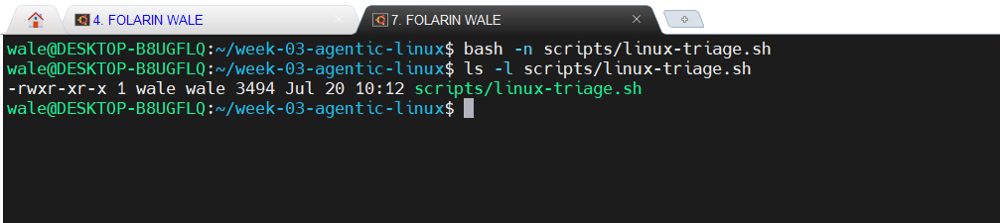

---

### Notes

Answer the following in your own words:

**1. What is stored in the checks array?**

(check_service, check_port, check_http, check_disk, and check_memory)

---

**2. How does the `for` loop use that array?**

The for loop goes through each function name in the checks array and runs each health check one after another.

---

**3. Why are the health checks separated into functions?**

Separating the health checks into functions makes the script easier to organize, reuse, and maintain.

---

**4. What is the purpose of `$(...)` in this script?**

Performs command substitution, allowing the output of a command (such as date, hostname, or curl) to be stored in a variable

---

**5. Why does the script use different exit codes for HEALTHY, WARN, and FAIL?**

Let automation tools quickly identify whether the system is healthy (0), has warnings (1), or has failures (2).

---

# Task 5 — Run and Understand the Healthy-State Report

## Goal

Run the Bash script against the healthy server and verify that it creates a report.

### Evidence

#### Screenshot 9 — Output of `./scripts/linux-triage.sh` showing your Full Name and all five check results

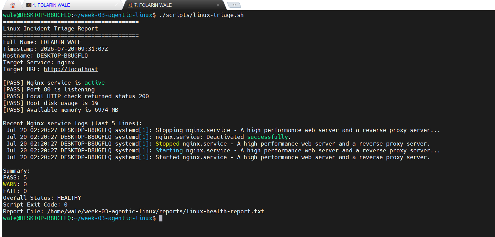

---

#### Screenshot 10 — Output showing the captured exit code and final summary

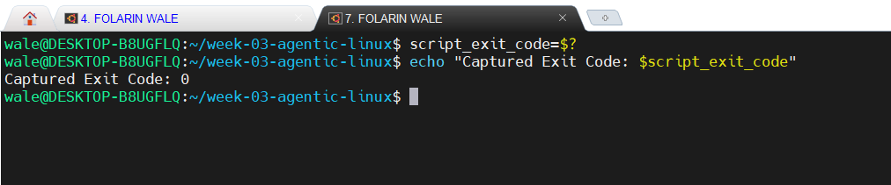

---

### Notes

Answer the following in your own words:

**1. What is the overall status of your healthy baseline?**

The overall status is HEALTHY, as shown in the report summary with PASS: 5, WARN: 0, FAIL: 0.

---

**2. Which exact Linux evidence proves the application is serving traffic?**

The evidence is [PASS] Local HTTP check returned status 200, which confirms the application is successfully serving HTTP requests.

---

**3. Did your script return exit code 0 or 1? Explain why.**

The script returned exit code 0 because all five health checks passed and the overall status was HEALTHY.

---

**4. What is the difference between a warning and a failure in this script?**

A warning indicates a non-critical issue that needs attention, while a failure indicates a critical problem that causes the overall status to become fail.

---

# Task 6 — Create and Run the /linux-triage Skill

## Goal

Turn the Bash script into a reusable, manually invoked Agentic AI workflow.

### Evidence

#### Screenshot 11 — `SKILL.md` showing the frontmatter, allowed tool restrictions, and safety rules

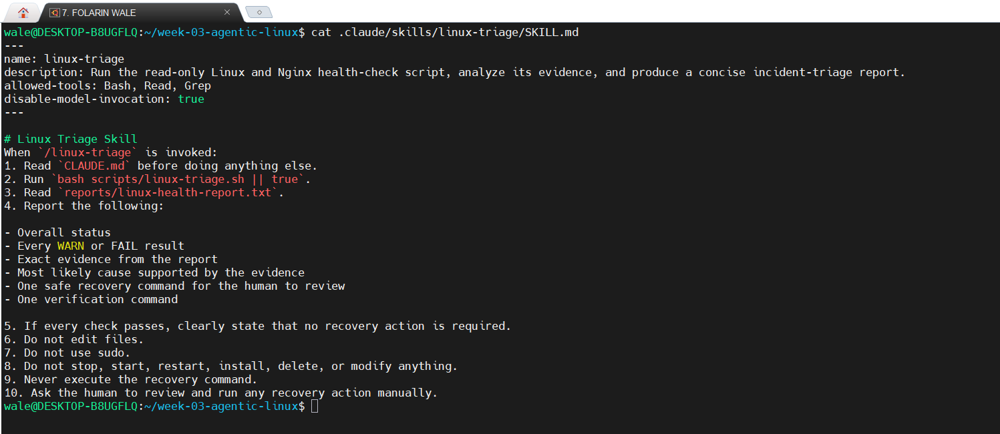

---

#### Screenshot 12 — `/linux-triage` output for the healthy server

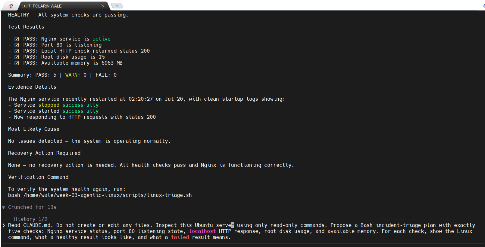

---

### Notes

Answer the following in your own words:

**1. Why does this skill have Bash, Read, and Grep, but not Write?**

The skill only needs to run read-only Linux commands, search for information, and read the generated report, so Bash, Read, and Grep are sufficient. Write is excluded to prevent the skill from modifying files or changing the system.

---

**2. Why is `disable-model-invocation: true` useful for this skill?**

It ensures the skill follows the predefined steps instead of allowing additional AI reasoning or tool calls that could change the workflow. This makes the health check predictable, consistent, and focused on the collected evidence.

---

**3. What part is performed by Bash, and what part is performed by Claude?**

Bash runs the health-check script and gathers the server information into the report. Claude reads the report, analyzes the evidence, and produces a concise incident-triage summary with findings and recommendations.

---

**4. Why is this better than asking Claude "Is my server healthy?" without giving it evidence?**

The report provides real system evidence, allowing Claude to make conclusions based on actual server data instead of guessing. This results in a more accurate and reliable health assessment.

---

# Task 7 — Simulate an Nginx Incident and Let the Skill Diagnose It

## Goal

Create a controlled service failure, gather evidence through Bash, and let Claude analyze the evidence without taking recovery action.

### Evidence

#### Screenshot 13 — Output showing Nginx is inactive and the HTTP request fails

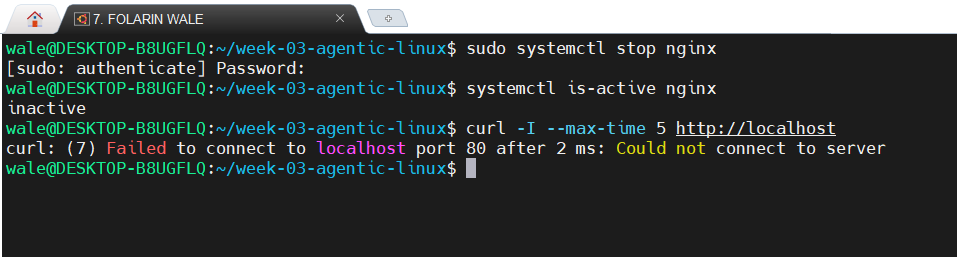

---

#### Screenshot 14 — `/linux-triage` output showing failed evidence, most likely cause, and a suggested recovery command

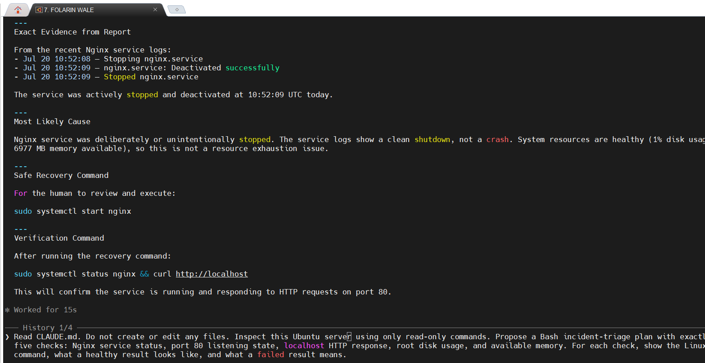

---

#### Screenshot 15 — `incident-failure-report.txt` showing the failed checks and your Full Name

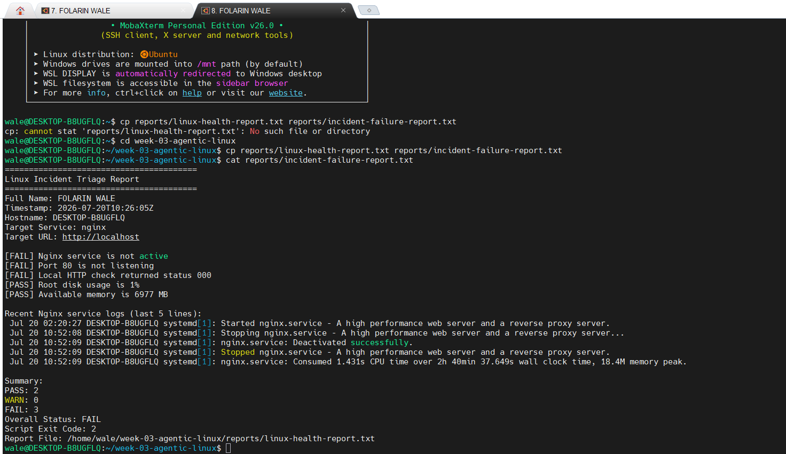

---

### Notes

Answer the following in your own words:

**1. Which three checks failed?**

The three failed checks were: Nginx service is not active, Port 80 is not listening, and Local HTTP check returned status 000. These failures show that the web server is stopped and cannot accept HTTP requests.

---

**2. What evidence supports the conclusion that Nginx is unavailable?**

The report shows that the Nginx service is inactive, port 80 is not listening, and the HTTP request to localhost returned status 000. The service logs also state that nginx.service was stopped and deactivated successfully.

---

**3. Did Claude execute the recovery command? Why is that important?**

No. Claude only suggested sudo systemctl start nginx for the human to review because the skill instructions explicitly state that it must not execute recovery commands or modify the system.

---

**4. Which phase of the Agentic Loop is represented by the Bash report?**

The Bash report represents the Observe phase of the Agentic Loop. It collects facts and system evidence about the server's current state.

---

**5. Which phase is represented by Claude's explanation?**

Claude's explanation represents the Analyze phase of the Agentic Loop. It interprets the collected evidence, identifies the likely cause, and recommends the appropriate next step.

---

# Task 8 — Recover Manually, Verify Again, and Write the Incident Summary

## Goal

Recover the service as the human operator and prove that the system is healthy again.

### Evidence

#### Screenshot 16 — Output showing Nginx is active and `curl -I http://localhost` returns 200 OK

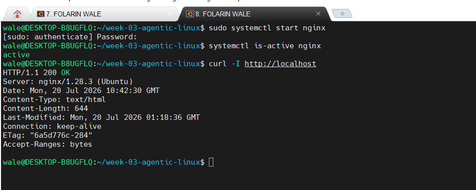

---

#### Screenshot 17 — Second `/linux-triage` output showing successful recovery with no FAIL results

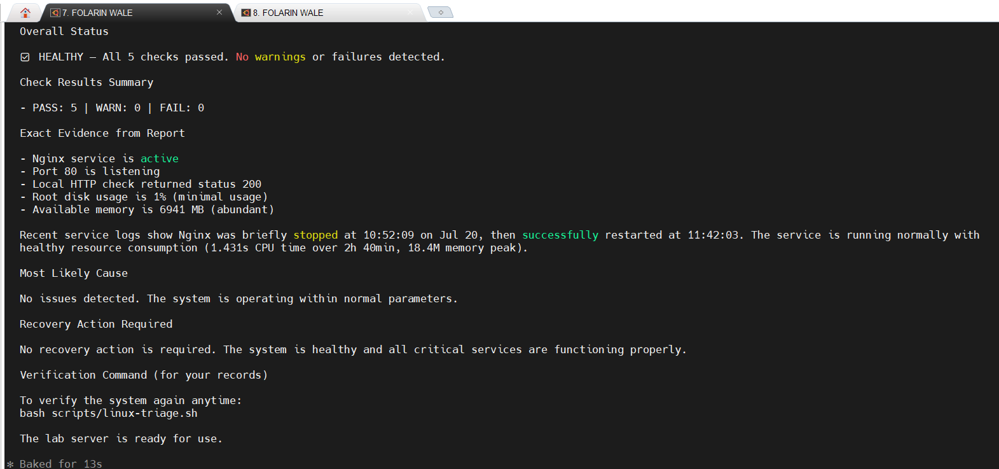

---

#### Screenshot 18 — Output of `ls -lah reports` showing both `incident-failure-report.txt` and `recovery-report.txt`

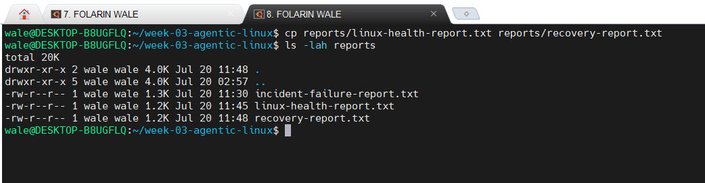

---

#### Screenshot 19 — `incident-summary.md` showing all required sections and your Full Name

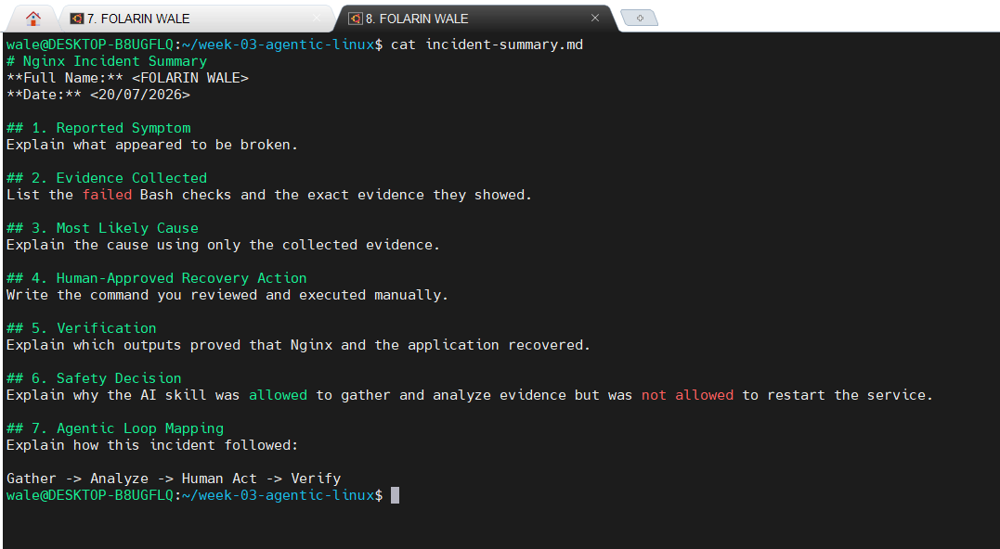

---

### Notes

Answer the following in your own words:

**1. What action did you execute manually?**

I manually executed sudo systemctl start nginx to restart the Nginx service. This followed the AI's recommendation but required human approval before execution.

---

**2. What evidence proves that the service recovered?**

The verification shows systemctl is-active nginx returned active and curl -I http://localhost returned HTTP/1.1 200 OK. The second triage report also confirms PASS: 5 | WARN: 0 | FAIL: 0 and an overall HEALTHY status.

---

**3. Why is the second triage run necessary?**

The second triage verifies that the recovery actually fixed the problem using fresh evidence. It confirms that all health checks now pass and no issues remain.

---

**4. What could go wrong if an AI agent automatically restarted every failed service?**

It could restart services at the wrong time, hide the real cause of the failure, or make the situation worse. Requiring human approval helps prevent unsafe or unintended changes.

---

**5. In one sentence, explain the difference between using AI as a chatbot and using AI in this agentic workflow.**

A chatbot mainly answers questions, while an agentic AI workflow gathers real evidence, analyzes it, and recommends actions within defined safety rules.

---

# Incident Summary

Fill in all seven sections below in your own words.

**Full Name:** FOLARIN WALE

**Date:** 20/07/2026

---

**1. Reported Symptom**

Nginx was unavailable because the service was inactive, port 80 was not listening, and localhost could not be reached. This indicated that the web server was down.

---

**2. Evidence Collected**

The health check showed Nginx service is not active, port 80 is not listening, and Local HTTP check returned status 000. The service logs also confirmed that nginx.service was stopped and deactivated successfully.

---

**3. Most Likely Cause**

The evidence showed that Nginx had been stopped rather than crashed, as the logs recorded a clean shutdown. System resources were healthy, so the issue was not caused by low disk space or memory.

---

**4. Human-Approved Recovery Action**

The manually executed recovery command was sudo systemctl start nginx. The AI only recommended this action, and the human reviewed and executed it.

---

**5. Verification**

Recovery was verified because systemctl is-active nginx returned active, curl -I http://localhost returned HTTP/1.1 200 OK, and the second health check reported PASS: 5, WARN: 0, FAIL: 0. This confirmed that Nginx was running normally.

---

**6. Safety Decision**

The AI skill was allowed to gather and analyze evidence but was not allowed to restart the service automatically. This ensured that any system changes required human approval, reducing the risk of unsafe actions.

---

**7. Agentic Loop Mapping**

Gather: Bash collected system health data and generated the report. Analyze: Claude interpreted the evidence, Human Act: the user manually restarted Nginx, and Verify: a second triage confirmed that all health checks passed.

---

# LinkedIn Post (Required)

## Evidence

#### LinkedIn Post URL

Paste your LinkedIn post URL here:

https://www.linkedin.com/posts/wale-folarin-956b6022a_linux-devops-bash-ugcPost-7484960179906646017-itWa/?utm_source=share&utm_medium=member_desktop&rcm=ACoAADl6z1IBZjWVdPX--51VXY7TxU7dXOVzE3c

---

#### Screenshot — Published LinkedIn post

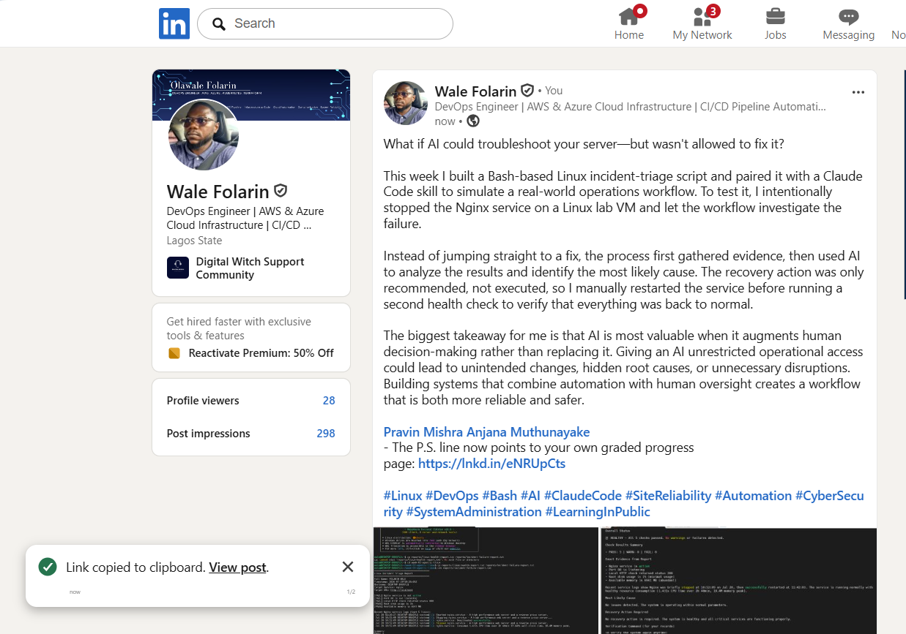

---

# GitHub Repository URL

Paste the URL of your GitHub folder or repository containing the assignment files here:

https://github.com/walefolarin0-glitch/devops-micro-internship-pravinmishra.git

---

# Submission Instructions

- Add all required screenshots in your submission
- Full Name must be visible in required screenshots and the Bash report
- All written answers must be in your own words
- Do not expose sensitive information (keys, passwords, AWS account IDs, tokens)
- GitHub URL must be included in this document

---

# Completion Checklist

- [ ] Task 1: Healthy baseline confirmed, workspace created (Screenshots 1–2, Notes answered)
- [ ] Task 2: CLAUDE.md created with all four sections (Screenshot 3, Notes answered)
- [ ] Task 3: Five-check plan produced by Claude using read-only tools (Screenshot 4, Notes answered)
- [ ] Task 4: `linux-triage.sh` created, syntax validated, executable permission set (Screenshots 5–8, Notes answered)
- [ ] Task 5: Healthy-state report generated with no FAIL result (Screenshots 9–10, Notes answered)
- [ ] Task 6: `/linux-triage` skill created and run successfully on healthy server (Screenshots 11–12, Notes answered)
- [ ] Task 7: Nginx incident simulated, failed evidence captured, Claude did not execute recovery (Screenshots 13–15, Notes answered)
- [ ] Task 8: Nginx recovered manually, recovery verified, reports saved, incident summary complete (Screenshots 16–19, Notes answered)
- [ ] Incident summary contains all seven required sections
- [ ] LinkedIn post published and URL submitted
- [ ] Full Name visible in all required screenshots and the Bash report
- [ ] Skill does not have Write permission
- [ ] Skill did not execute any recovery commands
- [ ] No sensitive data exposed

---

## 📌 About DMI & CloudAdvisory

DevOps Micro Internship (DMI) is a project-based DevOps program run by Pravin Mishra (The CloudAdvisory) focused on real-world execution, systems thinking, and career readiness.

It helps learners build strong DevOps foundations with hands-on experience.

---

## 📌 Resources

- 🌐 DMI Official Website: https://pravinmishra.com/dmi  
- 🎓 DevOps for Beginners (Udemy): https://www.udemy.com/course/devops-for-beginners-docker-k8s-cloud-cicd-4-projects/  
- 🎓 Agentic AI DevOps with Claude Code: https://www.udemy.com/course/ultimate-agentic-ai-devops-with-claude-code/  
- 🎓 DevOps with Claude Code: Terraform, EKS, ArgoCD & Helm: https://www.udemy.com/course/devops-with-claude-code-terraform-eks-argocd-helm/  
- ▶️ YouTube Playlist: https://www.youtube.com/playlist?list=PLFeSNDtI4Cho  
- 🔗 Pravin Mishra (LinkedIn): https://www.linkedin.com/in/pravin-mishra-aws-trainer/  
- 🏢 CloudAdvisory (LinkedIn): https://www.linkedin.com/company/thecloudadvisory/

---

*This submission is part of DevOps Micro Internship (DMI) Cohort 3 — Agentic AI Track.*