# Assignment 3 — CodeTrack: Branching Workflow (Add & Verify a Contact Page)

Part of the DevOps Micro Internship (DMI) Cohort 3 with Agentic AI

---

## Purpose

In this assignment, you will add a new Contact page to CodeTrack using a clean feature-branch workflow. You will keep each change in a separate commit, prove that your default branch remains unchanged before the merge, and validate the result after merging.

---

# Task 1 — Confirm Repository State and Default Branch

## Goal

Start from a clean default branch (`main` or `master`) and confirm the repository status.

### Evidence

#### Screenshot 1 — Output of `git status` and `git branch` showing a clean status and the default branch checked out

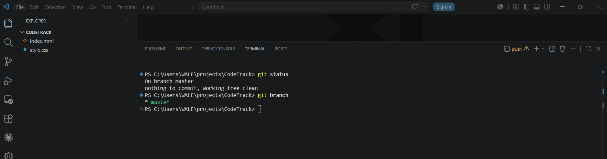

---

# Task 2 — Create and Switch to a Feature Branch

## Goal

Create a branch named exactly `feature/contact-page` and switch to it.

### Evidence

#### Screenshot 2 — Output of `git checkout -b feature/contact-page` and `git branch` showing `* feature/contact-page`

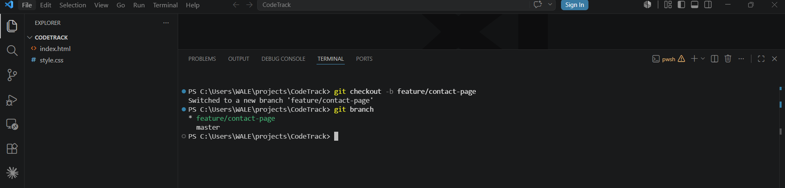

---

# Task 3 — Add contact.html on the Feature Branch

## Goal

Create `contact.html` with the provided content and commit it alone using the message `feat(contact): add Contact page`.

### Evidence

#### Screenshot 3 — Output of `ls` showing `contact.html`

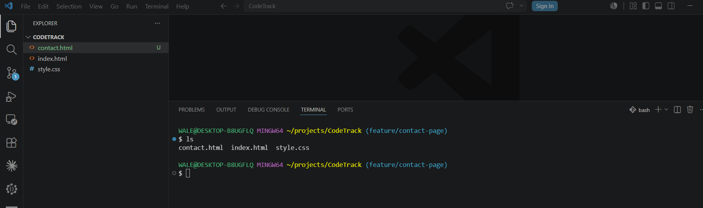

---

#### Screenshot 4 — Output of `git commit`

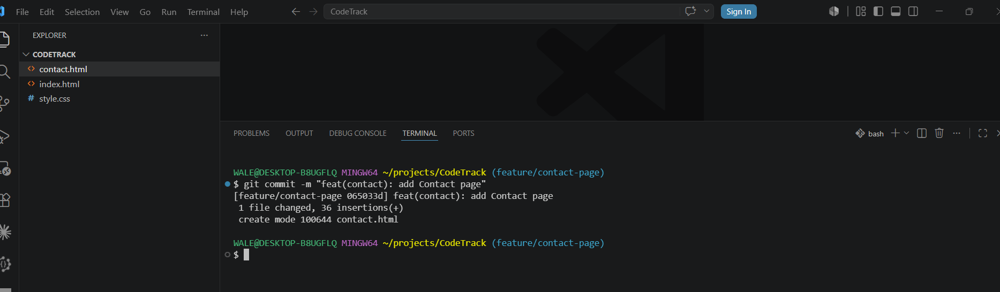

---

#### Screenshot 5 — Output of `git log --oneline -3` showing the new commit

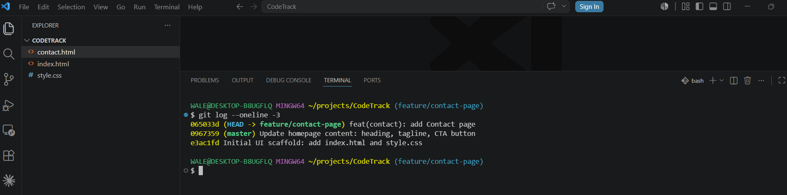

---

# Task 4 — Add the Contact Link to index.html

## Goal

Add the provided Contact Page link to `index.html` and commit it separately using the message `feat(nav): add Contact Page link`.

### Evidence

#### Screenshot 6 — Output of `git status` showing `index.html` as modified before staging

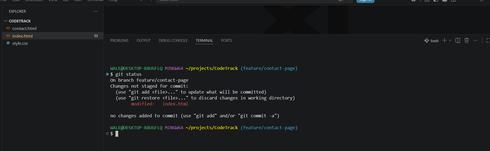

---

#### Screenshot 7 — Output of `git commit`

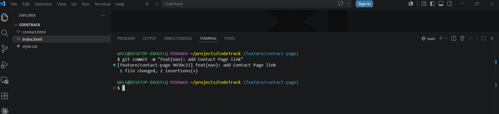

---

#### Screenshot 8 — Browser showing the Contact Page link on the homepage while on `feature/contact-page`

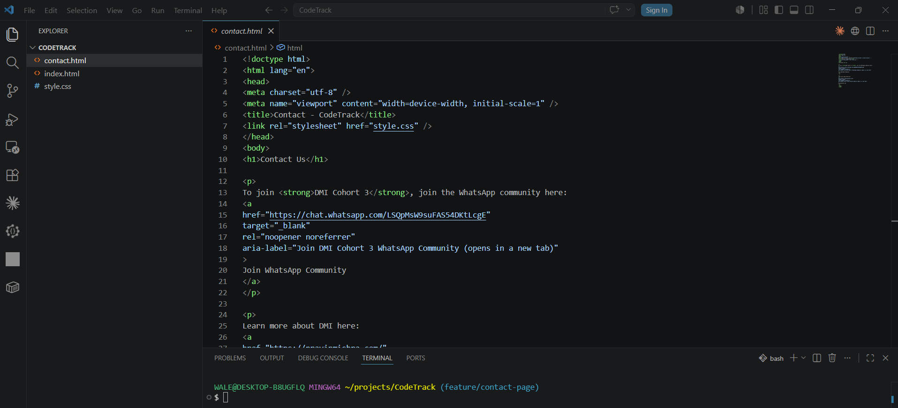

---

# Task 5 — Verify Isolation (Prove the Default Branch Is Unchanged)

## Goal

Switch back to the default branch and confirm that `contact.html` and the Contact Page link do not exist there yet.

### Evidence

#### Screenshot 9 — Terminal showing the checkout and `ls` output, proving `contact.html` is absent

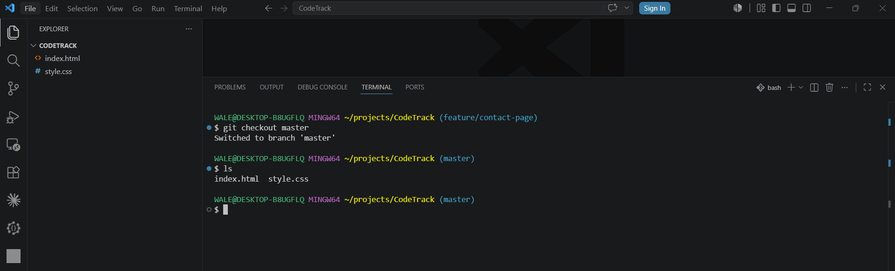

---

#### Screenshot 10 — Browser showing the homepage on the default branch with no Contact Page link

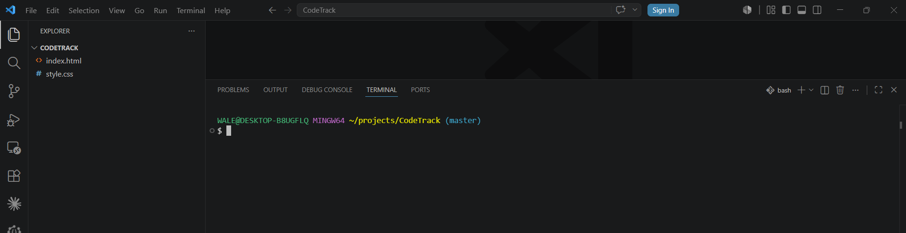

---

# Task 6 — Merge the Feature Branch into the Default Branch

## Goal

Merge `feature/contact-page` into your default branch and confirm the Contact page works.

### Evidence

#### Screenshot 11 — Output of `git merge feature/contact-page`

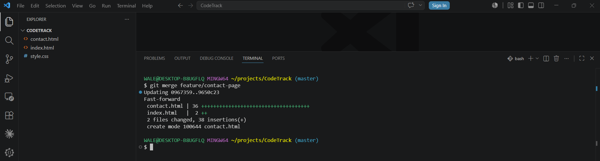

---

#### Screenshot 12 — Output of `ls` showing `contact.html` after the merge

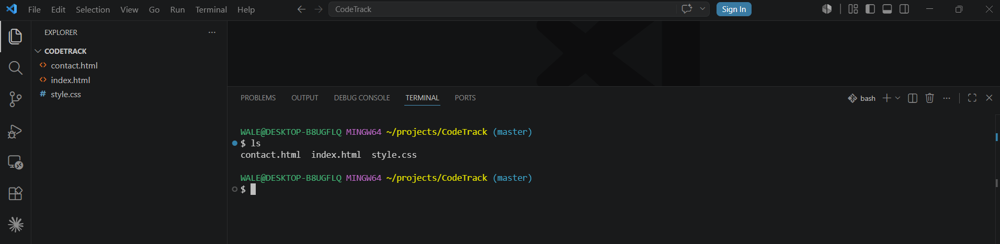

---

#### Screenshot 13 — Browser showing the Contact page opened from the homepage link on the default branch

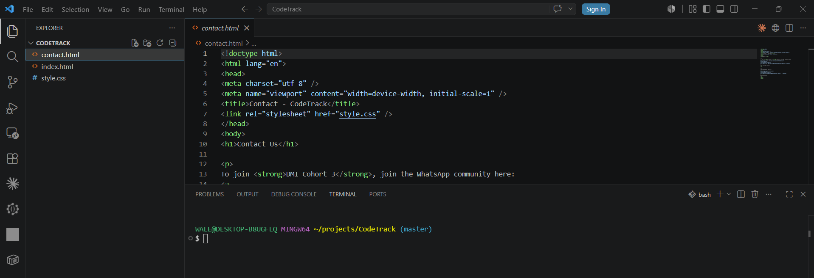

---

# Task 7 — Inspect History (Graph View)

## Goal

Display the repository history as a graph and locate both feature commits.

### Evidence

#### Screenshot 14 — Full output of `git log --oneline --graph --decorate --all`

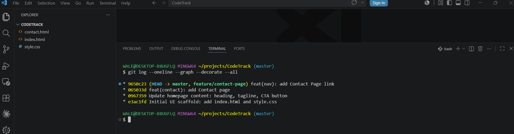

---

# Task 8 — Optional Cleanup (Delete the Feature Branch)

## Goal

Delete the merged `feature/contact-page` branch to keep your branch list clean.

### Evidence

#### Screenshot 15 (Optional) — Output showing `feature/contact-page` deleted and no longer listed

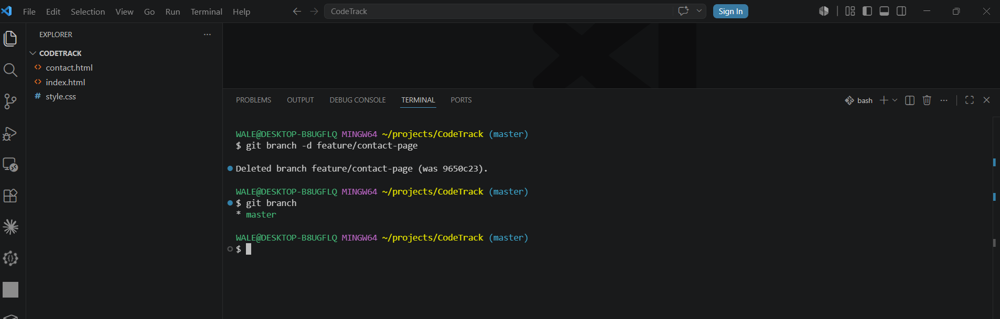

---

# Submission Instructions

- Tasks 1–7 are required; Task 8 is optional
- Add all required screenshots in your submission
- Evidence must show `contact.html` and the homepage link were absent before merging, and working after merging
- Do not expose passwords, access tokens, or private keys

---

# Completion Checklist

- [ ] Repository confirmed clean on the default branch (Screenshot 1)
- [ ] `feature/contact-page` created and checked out (Screenshot 2)
- [ ] `contact.html` added in its own commit (Screenshots 3–5)
- [ ] Homepage Contact link added in a separate commit (Screenshots 6–8)
- [ ] Default branch proven unchanged before merge (Screenshots 9–10)
- [ ] Feature branch merged and Contact page verified (Screenshots 11–13)
- [ ] Graph history reviewed (Screenshot 14)
- [ ] Optional cleanup completed (Screenshot 15)
- [ ] No sensitive data exposed

---

## 📌 About DMI & CloudAdvisory

DevOps Micro Internship (DMI) is a project-based DevOps program run by Pravin Mishra (The CloudAdvisory) focused on real-world execution, systems thinking, and career readiness.

It helps learners build strong DevOps foundations with hands-on experience.

---

## 📌 Resources

- 🌐 DMI Official Website: https://pravinmishra.com/dmi  
- 🎓 DevOps for Beginners (Udemy): https://www.udemy.com/course/devops-for-beginners-docker-k8s-cloud-cicd-4-projects/  
- 🎓 Agentic AI DevOps with Claude Code: https://www.udemy.com/course/ultimate-agentic-ai-devops-with-claude-code/  
- 🎓 DevOps with Claude Code: Terraform, EKS, ArgoCD & Helm: https://www.udemy.com/course/devops-with-claude-code-terraform-eks-argocd-helm/  
- ▶️ YouTube Playlist: https://www.youtube.com/playlist?list=PLFeSNDtI4Cho  
- 🔗 Pravin Mishra (LinkedIn): https://www.linkedin.com/in/pravin-mishra-aws-trainer/  
- 🏢 CloudAdvisory (LinkedIn): https://www.linkedin.com/company/thecloudadvisory/

---

*This submission is part of DevOps Micro Internship (DMI) Cohort 3 — Agentic AI Track.*
