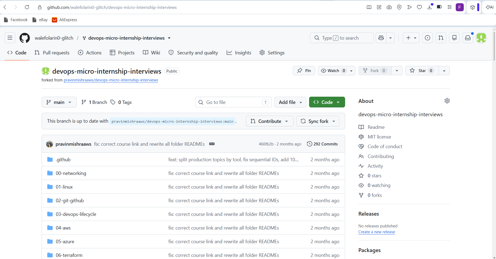
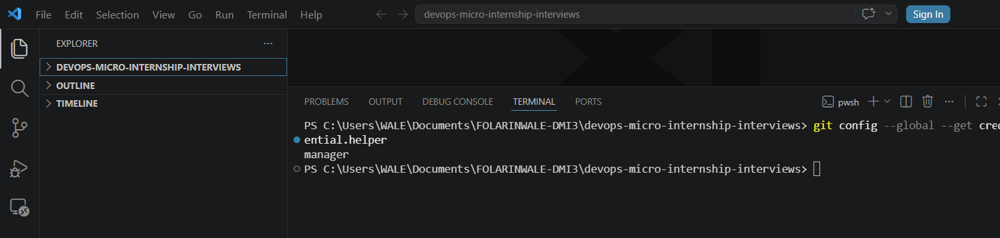
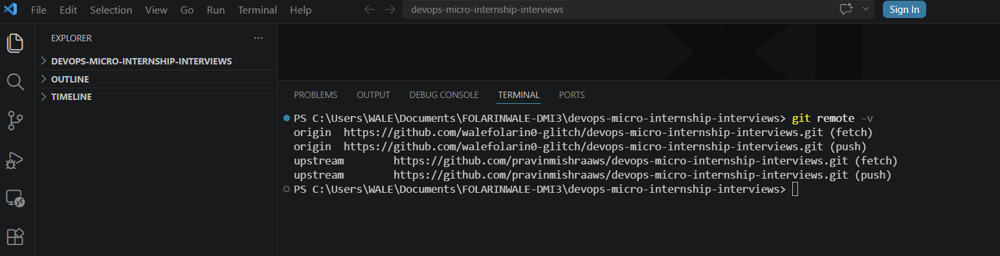
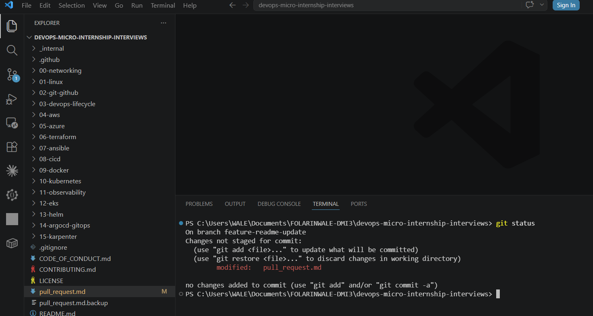
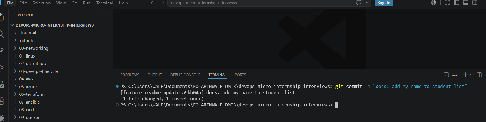
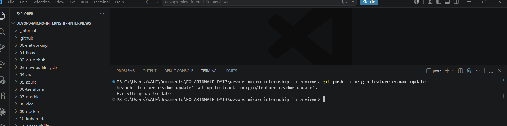
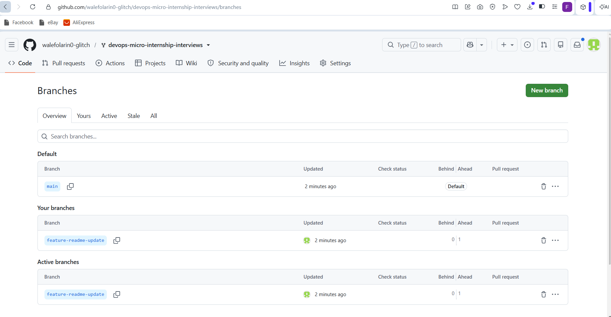
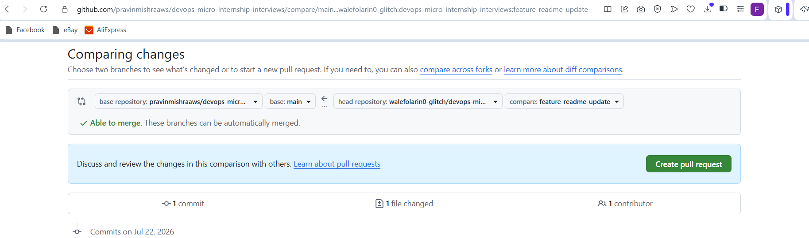
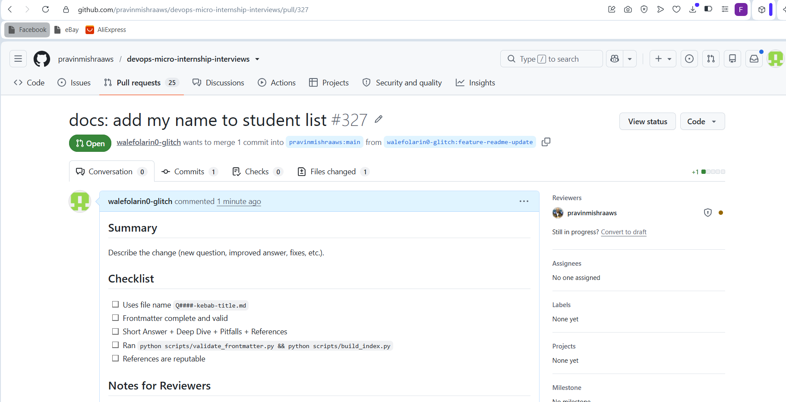
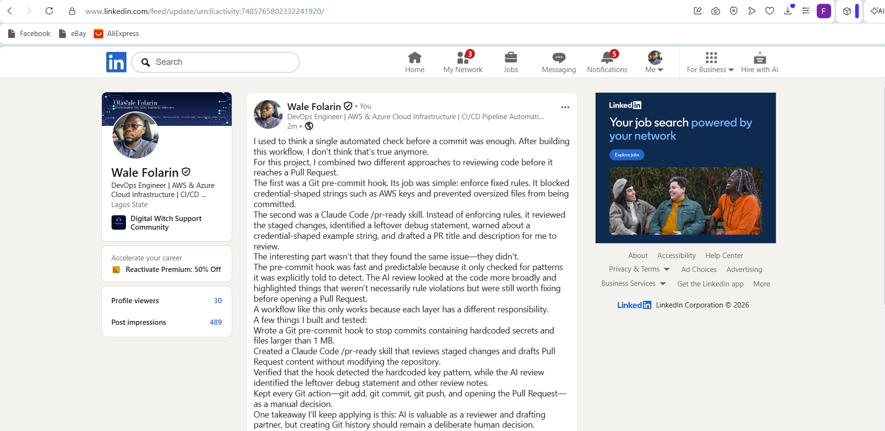

# Assignment 5 — Open-Source Collaboration: Fork, Clone, Sync & Pull Request

Part of the DevOps Micro Internship (DMI) Cohort 3 with Agentic AI

---

## Purpose

In this assignment, you will contribute one small documentation change to a shared repository using a standard open-source collaboration workflow: fork, clone, configure remotes, branch, commit, sync with upstream, push, and open a Pull Request. This is a different, separate practice repository from the one you submit your DMI work in.

---

# Task 0 — Fork the Upstream Repository

## Goal

Fork `pravinmishraaws/devops-micro-internship-interviews` into your own GitHub account.

### Evidence

#### Screenshot 1 — Your fork page with your username and `devops-micro-internship-interviews` visible in the browser URL

---

# Task 1 — Authenticate GitHub from the Terminal

## Goal

Configure one authentication method — HTTPS with a Personal Access Token, or SSH — so you can push to your fork. Use only one method.

### Evidence

#### Screenshot 2 — Output of `git config --global --get credential.helper` (HTTPS) or `ssh -T git@github.com` (SSH) showing successful authentication — never show your token or private key

---

# Task 2 — Clone Your Fork and Configure Remotes

## Goal

Clone your fork locally, then add the original repository as `upstream`.

### Evidence

#### Screenshot 3 — Output of `git remote -v` showing `origin` pointing to your fork and `upstream` pointing to `pravinmishraaws/devops-micro-internship-interviews`

---

# Task 3 — Create a Feature Branch and Make Your Change

## Goal

Create the branch `feature-readme-update`, add only your own entry (`Full Name — Group <Group Name/Number>`) to the Student List at the end of `pull_request.md`, and commit it with the message `docs: add my name to student list`.

### Evidence

#### Screenshot 4 — Output of `git status` showing `pull_request.md` modified before staging

---

#### Screenshot 5 — Output of `git commit`

---

# Task 4 — Synchronize with Upstream and Push to Your Fork

## Goal

Fetch and merge `upstream/main` into your local default branch, rebase your feature branch onto it, then push `feature-readme-update` to your fork.

### Evidence

#### Screenshot 6 — Output of `git push -u origin feature-readme-update` showing a successful push

---

#### Screenshot 7 — Your fork on GitHub showing `feature-readme-update` in the branch selector or a "Compare & pull request" banner

---

# Task 5 — Create a Pull Request to Upstream

## Goal

Open a Pull Request from `feature-readme-update` on your fork to `main` on the upstream repository, using the title `docs: add my name to student list`.

### Evidence

#### Screenshot 8 — Pull Request creation page showing the correct base repository, base branch, head repository, compare branch, and title

---

#### Screenshot 9 — Successfully created Pull Request page with the PR number visible

---

#### Pull Request URL

Paste your Pull Request URL here:

https://github.com/pravinmishraaws/devops-micro-internship-interviews/pull/327

---

# LinkedIn Post (Required)

## Evidence

#### LinkedIn Post URL

Paste your LinkedIn post URL here:

https://www.linkedin.com/posts/wale-folarin-956b6022a_dmibypravinmishra-git-github-ugcPost-7485765800935538688-TKyj/?utm_source=share&utm_medium=member_desktop&rcm=ACoAADl6z1IBZjWVdPX--51VXY7TxU7dXOVzE3c

---

#### Screenshot — LinkedIn post showing your successfully created Pull Request

---

# Submission Instructions

- Add all required screenshots in your submission
- Do not expose a Personal Access Token, SSH private key, password, or authentication secret
- Only your own entry in `pull_request.md` may be added — do not edit or delete another student's entry
- Include your fork URL and Pull Request URL

---

## Fork URL

Paste your fork URL here:

https://github.com/walefolarin0-glitch/devops-micro-internship-interviews.git

---

# Completion Checklist

- [ ] Upstream repository forked to your GitHub account (Screenshot 1)
- [ ] GitHub authentication configured securely (Screenshot 2)
- [ ] Fork cloned locally with `origin` and `upstream` configured (Screenshot 3)
- [ ] Only `pull_request.md` modified, with your own entry added (Screenshots 4–5)
- [ ] Local default branch synchronized with `upstream/main`, feature branch rebased and pushed (Screenshots 6–7)
- [ ] Pull Request opened against the correct upstream repository and branch (Screenshots 8–9)
- [ ] Fork URL and Pull Request URL included
- [ ] LinkedIn post published and URL submitted
- [ ] No PAT, password, private key, or authentication secret exposed

---

## 📌 About DMI & CloudAdvisory

DevOps Micro Internship (DMI) is a project-based DevOps program run by Pravin Mishra (The CloudAdvisory) focused on real-world execution, systems thinking, and career readiness.

It helps learners build strong DevOps foundations with hands-on experience.

---

## 📌 Resources

- 🌐 DMI Official Website: https://pravinmishra.com/dmi  
- 🎓 DevOps for Beginners (Udemy): https://www.udemy.com/course/devops-for-beginners-docker-k8s-cloud-cicd-4-projects/  
- 🎓 Agentic AI DevOps with Claude Code: https://www.udemy.com/course/ultimate-agentic-ai-devops-with-claude-code/  
- 🎓 DevOps with Claude Code: Terraform, EKS, ArgoCD & Helm: https://www.udemy.com/course/devops-with-claude-code-terraform-eks-argocd-helm/  
- ▶️ YouTube Playlist: https://www.youtube.com/playlist?list=PLFeSNDtI4Cho  
- 🔗 Pravin Mishra (LinkedIn): https://www.linkedin.com/in/pravin-mishra-aws-trainer/  
- 🏢 CloudAdvisory (LinkedIn): https://www.linkedin.com/company/thecloudadvisory/

---

*This submission is part of DevOps Micro Internship (DMI) Cohort 3 — Agentic AI Track.*
